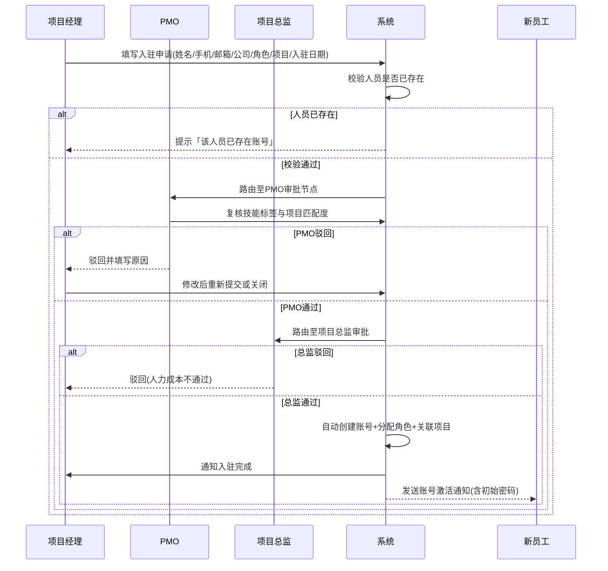
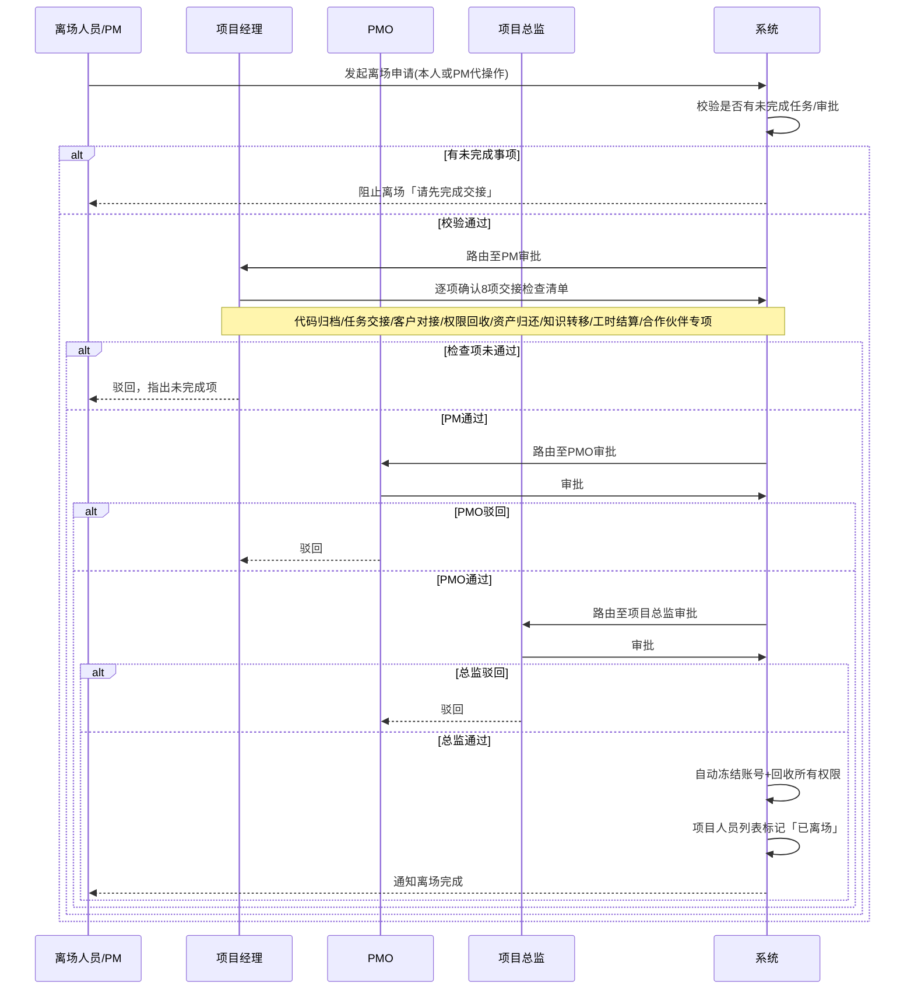
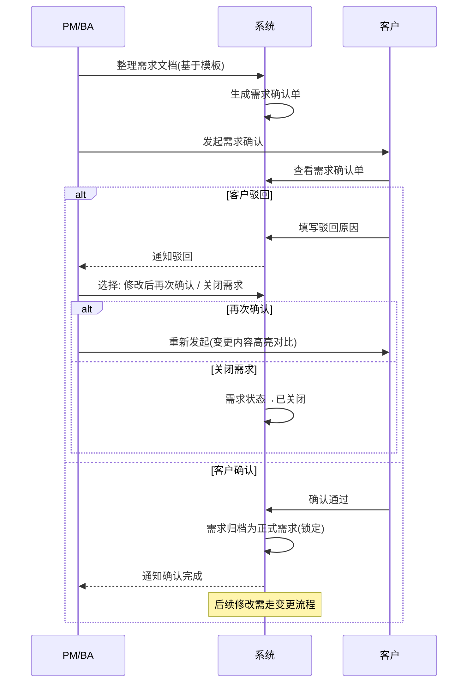
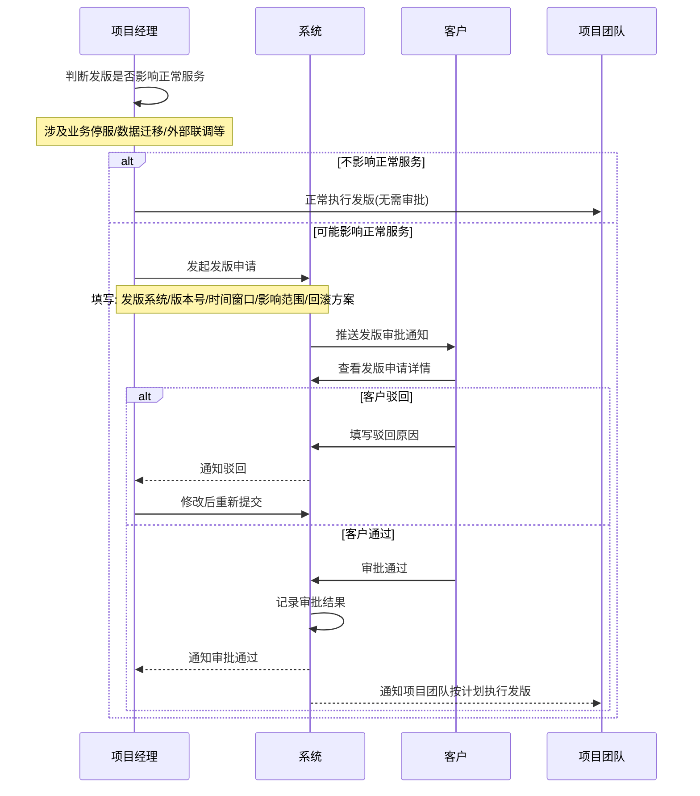

# 综合运营管理平台 — 产品需求文档（PRD）

> **版本**：v1.5  
> **日期**：2026-07-01  
> **状态**：评审稿  
> **密级**：内部  

---

## 版本更新说明

| 版本 | 日期 | 类型 | 更新内容 |
|------|------|:--:|---------|
| **v1.5** | 2026-07-01 | 小版本 | 新增原型设计支撑材料：10.10导航结构(IA)、10.11核心页面状态矩阵、10.12核心表单字段规格、10.13核心列表字段规格、10.14移动端H5页面清单 |
| **v1.4** | 2026-07-01 | 小版本 | ① 「大屏驾驶舱」全文更名为「平台数据总览」，新增首页入口+权限控制；② 10.8章节重写为「页面原型设计指南」（纯设计理论，参考Notion/Linear/ClickUp/Stripe/Foundry）；③ 移除原型截图和HTML文件 |
| **v1.3** | 2026-07-01 | 小版本 | 新增「月度绩效考核打分」功能（4.3.7）：PM每月月底对合作伙伴公司和内部团队进行综合打分，结果全员可见晾晒；月底倒数第二个工作日未完成打分则触发待办提醒和站内通知 |
| **v1.2** | 2026-06-30 | 小版本 | 新增设计约束「操作反馈与异常提示」（GC-10）：提交/完成类按钮点击后需给用户友好反馈，加载/操作失败时以非技术性语言提示用户并引导后续操作；附技术错误→用户友好提示映射表（12种场景）；后续迭代规划更新至10.3章节 |
| **v1.1** | 2026-06-30 | 小版本 | ① 模块命名规范化：管人→人员管理、管项目→项目管理、管指标→指标管理、管项目资产→资产管理；② 新增角色：合作伙伴方项目经理（PPM），角色总数14个；③ WBS纳入V1范围，新增5.4.4子章节；④ 密码重置完整流程设计（自助+管理员两种场景，含复制密码、强制登出、强制改密）；⑤ 新增设计约束「输入内容校验」（GC-09）；⑥ 新增设计约束「导出文件水印」（GC-08）；⑦ 登录后公共区域显示用户姓名+组织名称；⑧ 明确用户注册策略为全封闭受邀制（新增3.2.1章节）；⑨ 全文术语统一 |
| **v1.0** | 2026-06-30 | 大版本 | 初始版本，完成全部11个子系统需求撰写，含：产品概述与背景、用户画像与14角色定义、基础能力层（7子系统+审批流引擎）、四大核心业务模块（人员管理/项目管理/指标管理/资产管理）、横切关注点（多租户/等保/备份容灾/初始化向导）、非功能需求、附录（术语表/参考文档/迭代规划/待确认事项） |

---

> **当前版本 PRD 全文如下，可直接从头审阅。**

## 目录

1. [产品概述与背景](#1-产品概述与背景)
2. [用户画像与角色定义](#2-用户画像与角色定义)
3. [基础能力层](#3-基础能力层)
   - [3.1 账户与认证](#31-账户与认证)
   - [3.2 用户管理](#32-用户管理)
   - [3.3 个人中心](#33-个人中心)
   - [3.4 消息通知中心](#34-消息通知中心)
   - [3.5 系统配置](#35-系统配置)
   - [3.6 日志审计](#36-日志审计)
   - [3.7 反馈与建议](#37-反馈与建议)
   - [3.8 审批流引擎](#38-审批流引擎横切基础能力)
4. [人员管理](#4-人员管理)
5. [项目管理](#5-项目管理)
6. [指标管理](#6-指标管理)
7. [资产管理](#7-资产管理)
8. [横切关注点](#8-横切关注点)
9. [非功能需求](#9-非功能需求)
10. [附录](#10-附录)
   - [10.1 术语表](#101-术语表)
   - [10.2 参考文档](#102-参考文档)
   - [10.3 后续迭代规划](#103-后续迭代规划)
   - [10.4 权限矩阵](#104-权限矩阵14角色--全页面操作级)
   - [10.5 核心流程泳道图](#105-核心流程泳道图)
   - [10.6 数据模型ER图](#106-数据模型er图)
   - [10.7 测试用例清单](#107-测试用例清单)
   - [10.8 页面原型设计指南](#108-页面原型设计指南)
   - [10.9 待确认事项](#109-待确认事项更新)
   - [10.10 导航结构与信息架构](#1010-导航结构与信息架构)
   - [10.11 核心页面状态矩阵](#1011-核心页面状态矩阵)
   - [10.12 核心表单字段规格](#1012-核心表单字段规格)
   - [10.13 核心列表字段规格](#1013-核心列表字段规格)
   - [10.14 移动端H5页面清单](#1014-移动端h5页面清单)

---

## 1. 产品概述与背景

### 1.1 产品定位

**综合运营管理平台**是面向数字政府项目运维运营团队的一站式管理平台，以「人员管理、项目管理、指标管理、资产管理」为核心能力，覆盖项目团队从人员入驻到离场、从需求规划到发版上线、从指标监控到资产盘点的完整运营周期。

### 1.2 业务背景

某省份数字政府项目的运维运营团队面临以下核心痛点：

| 痛点 | 现状 | 目标 |
|------|------|------|
| **人员管理** | 人员入驻离场靠线下流程，工时靠Excel，合作伙伴多家公司管理混乱 | 流程线上化、数据可追溯、权限可管控 |
| **项目管理** | 多项目/多系统并行，进度不可视，需求确认靠邮件，发版审批无留痕 | 项目结构化管理、工具集支撑、审批流闭环 |
| **指标管理** | 指标散落各处，无统一口径，无法支撑领导决策和客户汇报 | 指标统一管理、自动计算、平台数据总览 |
| **资产管理** | 服务器/数据库/文档等资产信息靠人脑记忆，无台账，无生命周期管理 | 资产台账化、状态可追踪、变更可审计 |

### 1.3 目标用户

| 用户类别 | 说明 | 访问方式 |
|---------|------|---------|
| **内部员工** | 本公司员工，承担项目管理、需求管理、客户对接等角色 | 内部Portal（全量功能） |
| **合作伙伴员工** | 多家合作公司员工，承担研发、测试、交付等执行角色 | 内部Portal（按公司隔离） |
| **外部客户** | 客户方不同部门/处室的业务负责人 | 客户Portal（受限视图）+ 分享链接 |

### 1.4 产品边界

| 维度 | V1 范围 | 后续迭代 |
|------|---------|---------|
| 客户端 | PC Web + 移动端H5（审批/消息/工时） | 独立App/小程序 |
| 项目管理工具 | 看板、甘特图、里程碑、风险管理、WBS | 燃尽图、项目组合视图 |
| 指标分析 | 自动计算+人工填报、对比分析、平台数据总览 | 趋势预测、外部计算引擎 |
| 外部对接 | 平台内闭环，不接外部OA/BPM | 按需对接 |
| 多语言 | 仅中文 | 多语言支持 |

### 1.5 通用设计约束

> 以下约束适用于本系统所有模块，后续各章节不再重复声明。

| ID | 约束 | 说明 |
|----|------|------|
| GC-01 | **模板可修改** | 所有业务模板（周报、需求确认单、发版申请单、报表等）均支持用户自定义修改 |
| GC-02 | **模板可导入导出** | 所有模板支持标准格式（Excel/Word/PDF）导入导出 |
| GC-03 | **审批流可视化配置** | 所有审批流程支持可视化拖拽方式修改节点和流转条件 |
| GC-04 | **权限矩阵** | RBAC + 项目隔离 + 公司隔离，页面+操作级粒度 |
| GC-05 | **客户视图分离** | 客户仅可查看与自己相关的内容，内部管理细节（如成本、人员薪资等）不暴露 |
| GC-06 | **平台闭环** | 所有业务流程在平台内完成，V1不接入外部OA/BPM系统 |
| GC-07 | **数据留痕** | 所有关键操作（审批、修改、删除）均记录操作日志，不可物理删除业务数据 |
| GC-08 | **导出文件水印** | 所有导出文件（Excel/PDF）自动添加水印，水印内容为当前登录用户的姓名和组织机构名称 |
| GC-09 | **输入内容校验** | 所有需要用户输入内容的页面，系统应进行实时或提交时的内容校验，包括但不限于：输入格式校验（如邮箱格式、手机号格式、URL格式）、输入长度校验（最小/最大字符数）、必填项校验、数值范围校验。校验不通过时应以红色文字或边框明确提示错误位置和修改建议，引导用户完成修正 |
| GC-10 | **操作反馈与异常提示** | ① 用户点击提交、保存、确认、完成等结束性操作按钮后，系统应在操作完成后给予明确的结果反馈（成功/失败）。② 操作成功时，以绿色提示条或Toast通知告知用户操作已完成（如「保存成功」「提交成功」）。③ 操作失败时，应根据实际失败原因以**非技术性语言**向用户说明失败原因并提供后续操作引导。④ 禁止向用户展示技术性错误信息，包括但不限于：堆栈信息（Stack Trace）、数据库错误码（如ORA-XXXXX）、HTTP状态码裸码（如500 Internal Server Error）、中间件异常信息（如Redis connection timeout）。应替换为用户可理解的描述（见下表）。⑤ 页面加载超时或失败时，应显示「加载失败，请刷新页面重试」并提供「重新加载」按钮 |

**技术错误 → 用户友好提示映射表**：

| 技术错误场景 | ❌ 禁止展示 | ✅ 应展示 |
|-------------|-----------|---------|
| 网络超时 | `Network Error / timeout of 30000ms exceeded` | 「网络连接超时，请检查网络后重试」并提供「重试」按钮 |
| 服务端异常 | `500 Internal Server Error` | 「系统繁忙，请稍后重试。如持续出现请联系管理员」 |
| 数据库连接失败 | `ORA-12514: TNS:listener does not know...` | 「数据服务暂时不可用，请稍后重试」 |
| 请求频率过高 | `429 Too Many Requests` | 「操作过于频繁，请等待X秒后再试」（显示倒计时） |
| 权限不足 | `403 Forbidden / Access Denied` | 「您没有权限执行此操作，如需开通请联系项目管理员」 |
| 数据不存在 | `404 Not Found / NullPointerException` | 「该数据可能已被删除或您无权访问」 |
| 文件格式不支持 | `MultipartException / Invalid file format` | 「文件格式不支持，请上传 [支持格式列表] 格式的文件」 |
| 文件过大 | `MaxUploadSizeExceededException` | 「文件大小超出限制，请上传小于 [限制大小] 的文件」 |
| 重复提交 | `Duplicate entry / 唯一约束冲突` | 「该数据已存在，请勿重复提交」 |
| 会话过期 | `401 Unauthorized / Session expired` | 「登录已过期，请重新登录」并跳转登录页 |
| 关联数据冲突 | `Foreign key constraint fails` | 「该数据正在被其他业务使用，无法删除。请先解除关联后再操作」 |
| 系统维护中 | `503 Service Unavailable` | 「系统正在维护中，预计 [时间] 恢复，敬请谅解」 |

> **设计规范**：所有错误提示应以Toast（轻量操作反馈，2-3秒自动消失）或页面内提示条（重要提示，需手动关闭）形式展示。颜色：成功=绿色，警告=橙色，错误=红色。所有提示文案以中文呈现，语气礼貌、建设性，避免指责用户。

---

## 2. 用户画像与角色定义

### 2.1 角色总览

| 序号 | 角色名称 | 角色编码 | 归属类型 | 核心职责 |
|------|---------|---------|---------|---------|
| 1 | 项目总监 | DIR | 内部 | 项目整体把控、资源审批、重大决策 |
| 2 | PMO | PMO | 内部 | 项目群协调、流程规范、资源调度、数据统计 |
| 3 | 项目经理 | PM | 内部 | 需求管理、客户对接、进度管控、内外协调、结果负责 |
| 4 | 合作伙伴项目经理 | PPM | 合作伙伴 | 管理合作公司内的人员、任务分配、进度跟踪，配合内部PM协调执行 |
| 5 | 项目助理 | PA | 内部/合作伙伴 | 协助PM处理日常事务、会议纪要、文档整理 |
| 6 | 需求分析师 | BA | 内部/合作伙伴 | 需求调研、分析、PRD撰写、需求澄清 |
| 7 | UI设计师 | UI | 内部/合作伙伴 | 界面设计、交互设计、设计规范 |
| 8 | 前端研发 | FE | 内部/合作伙伴 | 页面开发、组件实现、前端联调 |
| 9 | 后端研发 | BE | 内部/合作伙伴 | 服务端开发、接口开发、数据层开发 |
| 10 | 测试工程师 | QA | 内部/合作伙伴 | 功能测试、集成测试、回归测试、缺陷管理 |
| 11 | 系统交付 | DEVOPS | 内部/合作伙伴 | 部署上线、环境配置、版本发布 |
| 12 | 系统运维 | OPS | 内部/合作伙伴 | 系统监控、故障处理、日常巡检 |
| 13 | 系统管理员 | ADMIN | 内部 | 系统配置、用户管理、权限分配、审计 |
| 14 | 客户方用户 | CUST | 外部 | 查看项目进展、周报、需求确认、发版审批、验收 |

### 2.2 归属类型说明

| 归属类型 | 说明 |
|---------|------|
| **内部** | 本公司正式员工，具有系统全部数据访问权限（受角色限制） |
| **合作伙伴** | 外部合作公司员工，数据按公司维度隔离，仅可见本公司人员数据 |
| **外部** | 客户方人员，仅可通过客户Portal访问，数据按处室隔离 |

### 2.3 客户组织模型

```
客户组织
  └── 部门（如：省发改委）
        └── 处室（如：信息化处）
              └── 业务线条（如：政务服务系统）
```

- 客户账号绑定到「处室+业务线条」
- 数据按处室隔离，不同处室客户互不可见
- 省级视角和市级视角分别组织，详见「指标管理」模块

---

## 3. 基础能力层

### 3.1 账户与认证

#### 3.1.1 功能清单

| 功能 | 说明 | EARS分类 |
|------|------|---------|
| 用户登录 | 账号密码登录 + 图形验证码（可配置开关） | Ubiquitous |
| 用户登出 | 主动登出 + 超时自动登出（时长可配置） | Ubiquitous |
| 密码修改 | 登录态下修改密码（需验证原密码） | Event-driven |
| 密码重置 | 管理员重置或忘记密码自助重置（详见3.1.2） | Event-driven |
| 首次登录引导 | 首次登录强制修改密码 + 完善个人信息 | Event-driven |
| 登录安全策略 | 连续失败锁定、密码复杂度、IP白名单 | Ubiquitous |
| 验证码 | 图形验证码（登录）+ 短信/邮箱验证码（密码重置） | Ubiquitous |

#### 3.1.2 EARS需求描述

**U-AC-01**：系统应要求所有用户（内部、合作伙伴、客户）通过账号密码进行身份认证后方可访问系统功能。

**U-AC-02**：系统应在用户连续登录失败达到可配置次数（默认5次）后，锁定该账号30分钟，并记录安全日志。

**U-AC-03**：系统应强制密码复杂度满足：长度≥8位，包含大写字母、小写字母、数字、特殊字符中至少三种。

**E-AC-01**：当用户点击「忘记密码」时，系统应引导用户通过已绑定的邮箱或手机号接收验证码，验证通过后进入自助密码重置流程（流程详见下方密码重置完整设计）。

**密码重置完整设计**：

密码重置支持两种场景：**用户自助重置**（忘记密码）和**管理员强制重置**。两种场景共享相同的密码生成和安全策略，仅在触发方式上不同。

**场景一：用户自助重置（忘记密码）**

```
用户点击「忘记密码」
  → 输入已绑定的手机号或邮箱
  → 系统发送6位数字验证码（有效期5分钟）
  → 用户输入验证码
  → 验证通过后，系统随机生成新密码（满足复杂度要求：长度≥8位，包含大小写字母+数字+特殊字符）
  → 页面显示重置后的新密码（明文展示，同时提供「复制密码」按钮）
  → 页面提示：「请使用新密码重新登录，登录后需修改密码」
  → 系统强制用户登出
  → 用户使用新密码登录
  → 登录后强制跳转至密码修改页面
  → 用户设置新密码（新密码不可与系统生成的密码相同）
  → 修改成功后进入系统首页
```

**场景二：管理员强制重置**

```
管理员在用户管理页面选择目标用户 → 点击「重置密码」
  → 二次确认弹窗：「确认重置该用户密码？重置后用户需使用新密码重新登录」
  → 确认后，系统随机生成新密码（满足复杂度要求）
  → 页面显示重置后的新密码（明文展示，同时提供「复制密码」按钮）
  → 管理员需将新密码通过安全渠道告知用户（建议电话或当面告知）
  → 同时系统向该用户发送短信/邮件通知：「您的密码已被管理员重置，请联系管理员获取新密码」
  → 系统强制该用户所有会话登出
  → 用户使用新密码登录后，强制跳转至密码修改页面
  → 用户设置新密码（新密码不可与系统生成的密码相同）
  → 修改成功后进入系统首页
```

**安全规则**：
- 系统生成的随机密码满足密码复杂度要求（U-AC-03）
- 随机密码生成后有效期为24小时，超期未使用则自动失效，需重新重置
- 密码重置操作记录安全日志
- 同一账号24小时内最多重置3次
- 密码修改页面应校验新密码与重置密码不相同

**E-AC-01a**：当用户/管理员触发密码重置后，系统应在结果页面上明文展示新生成的随机密码，并提供「复制密码」按钮，点击后复制到剪贴板并提示「密码已复制」。

**E-AC-01b**：当密码重置完成后，系统应强制该账号所有活跃会话登出。

**E-AC-01c**：当用户使用重置密码登录后，系统应强制跳转至密码修改页面，且校验新密码不可与系统生成的临时密码相同。

**U-AC-01a**（Unwanted）：如果用户24小时内密码重置次数超过3次，系统应拒绝重置并提示「今日重置次数已达上限，请明日再试」。

**E-AC-02**：当用户首次登录时，系统应强制跳转至密码修改页面，并要求完善个人信息（姓名、手机号、邮箱必填）。

**E-AC-03**：当用户会话超时（默认30分钟无操作）时，系统应自动登出并提示「会话已过期，请重新登录」。

**S-AC-01**：当用户处于登录态时，系统应在页面顶部公共区域（全局导航栏）明显显示用户头像、用户姓名、所属组织名称（内部员工显示公司名称+部门，合作伙伴显示所属合作公司名称，客户显示部门+处室名称）和当前项目上下文。

**U-AC-04**（Unwanted）：如果用户账号已被停用或锁定，系统应拒绝登录并显示明确提示「账号已停用/已锁定，请联系管理员」。

#### 3.1.3 页面清单

| 页面 | 路径 | 说明 |
|------|------|------|
| 登录页 | /login | 账号密码+验证码，记住登录状态 |
| 密码重置页 | /forgot-password | 邮箱/手机号验证→获取新密码→强制登录 |
| 首次登录引导页 | /onboarding | 修改密码+完善个人信息 |

---

### 3.2 用户管理

#### 3.2.1 用户注册策略

本系统采用**全封闭受邀制**，不开放公开注册入口。所有用户账号均通过以下三种受控方式创建：

| 创建方式 | 适用对象 | 说明 |
|---------|---------|------|
| 管理员手动创建 | 内部员工 | 系统管理员在用户管理页面手动创建或Excel批量导入 |
| 入驻流程自动创建 | 内部员工、合作伙伴员工 | PM发起入驻申请→PMO审批→项目总监审批通过后，系统自动创建账号 |
| PM发起客户账号创建 | 客户方用户 | PM发起→客户方领导确认→绑定部门处室业务线条→系统自动创建账号 |

> **安全考量**：数字政府场景下，公开注册存在账号冒用、权限越界的风险。全封闭受邀制确保所有账号可追溯至具体审批流程，满足等保三级对身份鉴别的要求。

#### 3.2.2 功能清单

| 功能 | 说明 |
|------|------|
| 用户列表 | 多维度筛选（姓名/角色/公司/项目/状态），分页展示 |
| 用户创建 | 管理员手动创建 / Excel批量导入 / 入驻流程自动创建 |
| 用户编辑 | 修改基本信息、角色分配、项目关联、公司归属 |
| 用户停用/启用 | 停用后不可登录，数据保留 |
| 用户删除 | 软删除（逻辑删除），数据保留 |
| 用户导入导出 | Excel批量导入/导出 |

#### 3.2.3 EARS需求描述

**U-UM-01**：系统应提供用户列表页面，支持按姓名、角色、归属公司、关联项目、状态（启用/停用）进行组合筛选。

**E-UM-01**：当系统管理员执行「批量导入用户」操作时，系统应校验Excel模板格式，校验通过后逐行创建用户，并返回导入结果（成功/失败明细）。

**E-UM-02**：当用户通过入驻流程审批通过后，系统应自动创建用户账号并分配初始角色和项目关联。

**S-UM-01**：当用户状态为「停用」时，系统应拒绝该用户登录，但在所有关联数据中保留该用户的记录（历史工时、任务、审批等）。

**U-UM-02**（Unwanted）：如果尝试删除的用户仍有未完成的任务或审批，系统应阻止删除并提示「该用户仍有进行中的任务/审批，请先完成交接」。

#### 3.2.4 页面清单

| 页面 | 路径 | 说明 |
|------|------|------|
| 用户列表 | /users | 筛选、分页、批量操作入口 |
| 用户详情 | /users/:id | 基本信息、角色、项目关联、操作日志 |
| 用户创建/编辑 | /users/create, /users/:id/edit | 表单页 |
| 批量导入 | /users/import | Excel上传+校验+导入结果 |

---

### 3.3 个人中心

#### 3.3.1 功能清单

| 功能 | 说明 |
|------|------|
| 个人信息 | 查看/编辑：头像、姓名、手机、邮箱、所属公司、部门 |
| 技能标签 | 查看/编辑自己的技能标签 |
| 我的项目 | 查看自己参与的所有项目及角色 |
| 我的任务 | 查看自己被指派的任务列表，快捷跳转 |
| 我的工时 | 查看自己的工时填报记录与统计 |
| 我的审批 | 查看待审批/已审批列表，快捷处理 |
| 我的周报 | 查看/编写/提交个人周报 |
| 账号安全 | 修改密码、绑定手机/邮箱、查看登录日志 |
| 通知偏好 | 配置哪些事件发送通知、通知方式（站内信/邮件） |

#### 3.3.2 EARS需求描述

**U-PC-01**：系统应为每个登录用户提供「个人中心」入口，统一展示个人相关信息和快捷操作。

**E-PC-01**：当用户修改手机号或邮箱时，系统应发送验证码到新手机号/邮箱，验证通过后方可更新。

**S-PC-01**：当用户在「我的审批」页面时，系统应默认展示「待审批」Tab，支持一键通过/驳回/转办操作。

**O-PC-01**：在支持头像上传的场景中，系统应限制上传文件格式为JPG/PNG，大小≤2MB，并自动裁剪为正方形。

#### 3.3.3 页面清单

| 页面 | 路径 | 说明 |
|------|------|------|
| 个人中心首页 | /profile | 信息概览+快捷入口 |
| 个人信息编辑 | /profile/info | 编辑基本信息 |
| 我的项目 | /profile/projects | 项目列表+角色 |
| 我的任务 | /profile/tasks | 任务列表，支持跳转 |
| 我的工时 | /profile/workhours | 工时记录+统计 |
| 我的审批 | /profile/approvals | 待审批/已审批 |
| 我的周报 | /profile/weekly | 周报列表+编写 |
| 账号安全 | /profile/security | 密码修改+安全日志 |
| 通知偏好 | /profile/notifications | 通知事件+渠道配置 |

---

### 3.4 消息通知中心

#### 3.4.1 功能清单

| 功能 | 说明 |
|------|------|
| 通知类型 | 站内信（默认）、邮件通知（可选） |
| 通知分类 | 审批通知、任务指派、@提及、预警告警、系统公告、周报提醒、绩效提醒 |
| 通知列表 | 按分类筛选、已读/未读状态、批量标已读 |
| 通知详情 | 点击通知跳转到关联业务页面 |
| 通知设置 | 用户自定义哪些事件通知、通知渠道 |
| 通知优先级 | 紧急（红色）、重要（橙色）、普通（蓝色） |
| 通知聚合 | 同类通知自动聚合（如"您有5条待审批"） |
| 系统公告 | 管理员发布全局/项目级公告，支持置顶和有效期 |
| 消息模板 | 各类消息通知模板可配置 |

#### 3.4.2 EARS需求描述

**U-NC-01**：系统应在全局顶部导航栏显示未读通知数量角标，点击展开通知下拉面板。

**E-NC-01**：当用户被指派新任务时，系统应自动发送站内信通知，内容包含任务名称、指派人和截止时间。

**E-NC-02**：当审批流到达用户节点时，系统应发送站内信通知，并可选邮件通知（根据用户偏好）。

**E-NC-03**：当指标超过预警阈值时，系统应向相关项目PM和PMO发送预警通知。

**S-NC-01**：当通知下拉面板展开时，系统应按时间倒序展示最近50条通知，未读通知高亮显示。

**U-NC-02**（Unwanted）：如果通知关联的业务对象已被删除，系统应标记该通知为「已失效」而非报错。

#### 3.4.3 页面清单

| 页面 | 路径 | 说明 |
|------|------|------|
| 通知中心 | /notifications | 全部通知列表，支持筛选和批量操作 |
| 通知设置 | /profile/notifications | 个人通知偏好配置 |
| 系统公告管理 | /admin/announcements | 管理员发布/编辑/置顶公告 |

---

### 3.5 系统配置

#### 3.5.1 功能清单

| 功能 | 说明 |
|------|------|
| 基础配置 | 系统名称、Logo、版权信息 |
| 审批流配置 | 可视化拖拽配置各类审批流程（详见审批流引擎章节） |
| 模板管理 | 集中管理所有业务模板（周报、需求确认单、发版申请单、报表等） |
| 角色权限配置 | 角色定义、权限分配、页面+操作级权限矩阵 |
| 字典管理 | 系统中所有下拉选项、枚举值统一维护 |
| 菜单管理 | 菜单可见性配置（按角色），支持菜单排序 |
| 参数配置 | 系统运行参数 |
| 节假日配置 | 维护节假日日历，用于工时/排期计算 |

#### 3.5.2 字典管理详细清单

| 字典类别 | 字典项示例 | 适用模块 |
|---------|-----------|---------|
| 技能标签库 | Java、Python、Vue、项目管理、需求分析... | 人员管理 |
| 资产类别 | 服务器、数据库、中间件、代码仓库... | 资产管理 |
| 指标大类 | 进度、质量、成本、可用性、办件服务... | 指标管理 |
| 项目状态 | 规划中、执行中、已验收、已结项 | 项目管理 |
| 任务状态 | 待开始、进行中、已完成、已关闭 | 项目管理 |
| 风险等级 | 高、中、低 | 项目管理 |
| 公司类型 | 内部、合作伙伴 | 人员管理 |
| 行政区划 | 省、市、区/县 | 指标管理 |

#### 3.5.3 EARS需求描述

**U-SC-01**：系统应提供「字典管理」功能，支持所有下拉选项的统一增删改查，修改后实时生效。

**U-SC-02**：系统应提供「模板管理」功能，支持所有业务模板的集中管理，包括模板的创建、编辑、导入、导出。

**E-SC-01**：当管理员修改审批流配置并保存后，系统应即时生效，新发起的审批使用新流程，进行中的审批不受影响。

**S-SC-01**：当系统处于节假日配置的日期范围内时，工时填报和排期计算应自动跳过节假日。

**U-SC-03**（Unwanted）：如果管理员尝试删除正在被使用的字典项，系统应阻止删除并提示「该项已被引用，无法删除」。

#### 3.5.4 页面清单

| 页面 | 路径 | 说明 |
|------|------|------|
| 基础配置 | /admin/settings/basic | 系统名称、Logo等 |
| 审批流配置 | /admin/settings/workflow | 可视化拖拽配置 |
| 模板管理 | /admin/settings/templates | 模板列表+CRUD |
| 角色权限配置 | /admin/settings/roles | 角色+权限矩阵 |
| 字典管理 | /admin/settings/dict | 字典分类+字典项 |
| 菜单管理 | /admin/settings/menus | 菜单树+可见性 |
| 参数配置 | /admin/settings/params | 系统参数 |
| 节假日配置 | /admin/settings/holidays | 节假日日历 |

---

### 3.6 日志审计

#### 3.6.1 功能清单

| 功能 | 说明 |
|------|------|
| 操作日志 | 记录所有用户的关键操作：谁、什么时间、做了什么、IP、结果 |
| 登录日志 | 记录所有登录/登出行为，包括失败登录 |
| 审批日志 | 记录所有审批流节点操作（通过/驳回/转办/加签） |
| 数据变更日志 | 关键数据（指标、资产等）的修改前后对比留痕 |
| 日志查询 | 按时间、用户、操作类型、模块筛选，支持导出 |
| 日志保留策略 | 可配置保留时长（默认6个月），超期自动归档 |

#### 3.6.2 EARS需求描述

**U-LA-01**：系统应自动记录所有用户的关键操作日志，包含：操作人、操作时间、IP地址、操作类型、操作对象、操作结果。

**U-LA-02**：系统应保留操作日志至少6个月，超期日志可配置自动归档或清理。

**E-LA-01**：当用户执行审批操作（通过/驳回/转办/加签）时，系统应记录审批日志，包含审批节点、审批意见、审批时间。

**E-LA-02**：当指标数据被修正时，系统应记录修正前后的值、修正人、修正时间和修正原因。

**U-LA-03**（Unwanted）：日志记录功能不应影响正常业务流程的响应时间。如果日志写入失败，系统应降级处理（异步重试），不阻断业务操作。

#### 3.6.3 页面清单

| 页面 | 路径 | 说明 |
|------|------|------|
| 操作日志 | /admin/audit/operation | 查询+导出 |
| 登录日志 | /admin/audit/login | 查询+导出 |
| 审批日志 | /admin/audit/approval | 查询+导出 |
| 数据变更日志 | /admin/audit/data | 查询+对比查看 |

---

### 3.7 反馈与建议

#### 3.7.1 功能清单

| 功能 | 说明 |
|------|------|
| 意见反馈 | 用户提交反馈/建议，支持分类、截图附件 |
| 反馈处理 | 管理员查看、标记状态、回复用户 |
| 反馈统计 | 按分类、状态、时间统计 |
| 更新日志 | 管理员发布版本更新日志 |

#### 3.7.2 EARS需求描述

**E-FB-01**：当用户提交反馈时，系统应自动分配反馈编号，并通知系统管理员。

**E-FB-02**：当管理员回复用户反馈后，系统应通知反馈提交人。

**S-FB-01**：当反馈状态变更为「已采纳」或「已实现」时，系统应在更新日志中体现。

**O-FB-01**：在反馈表单中，系统应支持上传截图附件（PNG/JPG，≤5MB，最多3张）。

---

## 3.8 审批流引擎（横切基础能力）

> 审批流引擎是贯穿所有业务模块的基础能力，在此集中描述。

### 3.8.1 核心能力

| 能力 | 说明 |
|------|------|
| 可视化设计器 | bpmn-js 实现拖拽式流程设计，支持节点增删、连线配置、条件分支 |
| 审批节点类型 | 单人审批、多人会签（全部通过/任一通过）、加签、转办、退回、委托 |
| 流转条件 | 支持按表单字段值、角色、部门等条件动态路由 |
| 流程模板 | 预置常用审批流模板，支持另存为和导入导出 |
| 流程版本 | 修改后另存为新版本，进行中的流程不受影响 |
| 流程监控 | 管理员查看所有进行中/已完成的审批流状态 |

### 3.8.2 系统中涉及的审���流

| 审批流 | 发起人 | 审批链路 | 所属模块 |
|--------|--------|---------|---------|
| 人员入驻 | PM | PMO → 项目总监 | 人员管理 |
| 人员离场 | 本人/PM | PM → PMO → 项目总监 | 人员管理 |
| 工时审批 | 一线人员 | PM（周度汇总审批） | 人员管理 |
| 需求确认 | PM | 客户确认/驳回 | 项目管理 |
| 发版审批 | PM | 客户审批 | 项目管理 |
| 系统对接（内部） | 需方PM | 供方PM → 公司领导（系统内指定审批人，通常为项目总监DIR角色） | 项目管理 |
| 系统对接（外部） | PM | 客户 | 项目管理 |
| 资产状态变更 | 责任人 | 按资产类别可配置 | 资产管理 |
| 指标数据补录 | 填报人 | PM审批 | 指标管理 |
| 指标数据修正 | 填报人 | PM审批 | 指标管理 |
| 客户账号创建 | PM | 客户方领导确认 | 用户管理 |
| 月度绩效考核 | PM | 无审批节点，提交即生效，结果自动推送 | 人员管理 |

### 3.8.3 EARS需求描述

**U-WF-01**：系统应基于Flowable流程引擎实现所有审批流，支持BPMN 2.0标准。

**U-WF-02**：系统应提供基于bpmn-js的可视化流程设计器，管理员可通过拖拽方式修改审批节点和流转条件。

**E-WF-01**：当审批流到达用户节点时，系统应在「我的审批」列表中展示该待审批项，并通过消息通知中心推送通知。

**E-WF-02**：当审批被驳回时，系统应通知发起人并允许修改后重新提交，或选择关闭。

**S-WF-01**：当审批流处于「进行中」状态时，发起人可查看当前审批进度（已通过/待审批节点高亮）。

**U-WF-02**（Unwanted）：如果审批流中某节点审批人已离场或停用，系统应自动将该节点的审批转交给其直属上级或流程管理员。

---

---

## 4. 人员管理

### 4.1 模块概述

「人员管理」模块覆盖项目人员从入驻到离场的完整生命周期管理，包含：入驻/离场流程、工时填报与审批、技能标签体系、角色权限矩阵、合作伙伴公司管理、三层周报体系、月度绩效考核。

### 4.2 用户故事

| 编号 | 角色 | 用户故事 |
|------|------|---------|
| US-HR-01 | PM | 作为项目经理，我希望在线发起人员入驻申请，以便快速为新成员开通系统权限 |
| US-HR-02 | PMO | 作为PMO，我希望审批入驻申请时能看到人员技能标签和项目匹配度 |
| US-HR-03 | 一线人员 | 作为研发/测试人员，我希望每天快捷填报工时到具体任务 |
| US-HR-04 | PM | 作为PM，我希望每周汇总审批团队工时，了解人力投入分布 |
| US-HR-05 | 合作伙伴员工 | 作为合作伙伴，我希望只能看到本公司人员数据 |
| US-HR-06 | 项目总监 | 作为项目总监，我希望看到全项目的人员分布和工时投入 |
| US-HR-07 | PM | 作为PM，我希望每月对合作公司和内部团队进行绩效打分，结果晾晒给干系人 |
| US-HR-08 | 合作伙伴项目经理 | 作为合作伙伴项目经理，我希望看到自己公司的月度绩效评分和评语 |

### 4.3 子模块

#### 4.3.1 人员入驻流程

**流程**：`PM发起 → PMO审批（复核技能匹配）→ 项目总监审批（批准人力成本）→ 自动开通账号和权限`

**关键规则**：
- 入驻无需客户方审批，纯内部流程
- PMO审批时需查看人员技能标签与项目需求匹配度
- 审批通过后系统自动创建用户账号、分配初始角色和项目关联
- 合作伙伴员工入驻时需选择所属合作公司

**EARS需求**：

**E-HR-01**：当PM发起人员入驻申请时，系统应要求填写：人员姓名、手机号/邮箱、所属公司（内部/具体合作伙伴公司）、拟分配角色、关联项目、预计入驻日期。

**E-HR-02**：当入驻申请提交后，系统应按审批流配置自动路由至PMO审批节点。

**E-HR-03**：当入驻审批全部通过后，系统应自动创建用户账号、发送账号激活通知（含初始密码链接），并分配角色和项目关联。

**S-HR-01**：当入驻审批进行中时，发起人可在「我的审批」中查看当前进度。

**U-HR-01**（Unwanted）：如果入驻申请中的人员已存在系统账号（相同手机号/邮箱），系统应提示「该人员已存在账号」，不允许重复创建。

#### 4.3.2 人员离场流程

**流程**：`本人发起（或PM代操作）→ PM审批 → PMO审批 → 项目总监审批 → 自动冻结账号+回收权限`

**离场交接检查项（8项）**：

| 序号 | 检查项 | 说明 |
|------|--------|------|
| 1 | 代码/文档归档 | 所有代码已提交合并、文档已归档至项目资产库 |
| 2 | 任务/需求交接 | 进行中的任务已转派或关闭，已指定接手人 |
| 3 | 客户对接交接 | 客户关系已交接，关键联系人和待协调事项已同步 |
| 4 | 系统权限回收 | 生产环境账号、VPN、服务器、数据库等权限已回收 |
| 5 | 资产归还 | 公司设备（电脑、显示器、UKey等）已归还 |
| 6 | 知识转移 | 完成离场交接会议，接手人确认 |
| 7 | 工时结算 | 历史工时已全部填报审批完毕 |
| 8 | 合作伙伴专项 | 合同状态确认、离场日期与合同一致 |

**EARS需求**：

**E-HR-04**：当离场申请提交后，系统应展示8项交接检查清单，由PM逐项确认后流转审批。

**E-HR-05**：当离场审批全部通过后，系统应自动冻结账号（非删除）、回收所有权限、在项目人员列表中标记「已离场」。

**U-HR-02**（Unwanted）：如果离场人员仍有未完成的任务或审批，系统应阻止离场并提示「该人员仍有进行中的任务/审批，请先完成交接后再发起离场」。

**U-HR-03**（Unwanted）：离场人员的项目历史数据（工时、任务记录、审批记录）应永久保留，不可删除。

#### 4.3.3 工时填报与审批

**填报模式**：一线人员按天填报到具体任务/需求/项目，每周汇总后PM审批

**关键规则**：
- 工时不与薪酬挂钩，仅用于人天统计
- 单日填报 ≤ 24小时
- 不能填报未来日期
- 支持按任务、需求、项目三个维度填报

**EARS需求**：

**E-HR-06**：当用户进入工时填报页面时，系统应默认展示当天日期，列出该用户关联项目下的所有活跃任务供选择。

**E-HR-07**：当用户提交单日工时后，系统应实时更新本周累计工时统计。

**E-HR-08**：每周一，系统应自动汇总上周团队所有成员工时，生成汇总表推送至PM审批。

**E-HR-09**：当PM审批驳回某条工时记录时，系统应通知填报人并允许修改后重新提交。

**U-HR-04**（Unwanted）：如果用户填报的单日工时超过24小时，系统应拒绝提交并提示「单日工时不能超过24小时」。

#### 4.3.4 技能标签体系

**标签来源**：系统预置标签库 + PM/本人人工打标

**预置标签库**（按类别）：

| 类别 | 标签示例 |
|------|---------|
| 编程语言 | Java、Python、JavaScript、Go、C++、SQL |
| 框架 | Spring Boot、Vue、React、MyBatis、Flask |
| 数据库 | MySQL、PostgreSQL、Oracle、达梦DM8、Redis |
| 工具平台 | Docker、K8s、Git、Jenkins、Nginx |
| 业务领域 | 政务服务、电子证照、数据共享、好差评 |
| 软技能 | 项目管理、需求分析、技术方案、客户沟通 |

**EARS需求**：

**E-HR-10**：当PM或用户本人编辑技能标签时，系统应提供标签库下拉选择+自由输入补充。

**O-HR-01**：在人员入驻审批环节，系统应展示人员的技能标签，辅助PMO判断技能匹配度。

#### 4.3.5 合作伙伴公司管理

**管理维度**：多家合作公司，每家公司管理：基本信息、合同信息、人员归属、按公司维度统计和权限隔离

**EARS需求**：

**U-HR-05**：系统应提供合作伙伴公司管理功能，包含公司名称、统一社会信用代码、联系人、合同起止日期。

**U-HR-06**：系统应按公司维度进行数据隔离——合作伙伴员工仅可查看本公司人员数据和相关项目数据。

**E-HR-11**：当合作伙伴员工入驻时，系统应强制选择所属合作公司，不可为空。

#### 4.3.6 周报体系

**三层周报结构**：

| 层级 | 输出者 | 内容来源 | 阅读者 |
|------|--------|---------|--------|
| 个人周报 | 内部/合作伙伴员工 | 手动填报本周工作+下周计划 | PM |
| 项目周报 | PM | 汇总个人周报+手动补充 | 内部管理层、PMO |
| 客户周报 | PM | 按业务线条汇总+手动编写 | 客户方对应处室 |

**关键规则**：
- 个人周报混合模式：从工时/任务自动提取+手动补充
- 项目周报和客户周报由PM编写
- 客户周报按处室隔离，客户仅见自己业务线条的周报
- 周报模板内置通用模板，PM有权修改
- 模板遵循GC-01/GC-02通用设计约束

**EARS需求**：

**E-HR-12**：每周五下午，系统应自动提醒所有成员填写个人周报。

**E-HR-13**：当PM编写客户周报时，系统应支持按业务线条维度筛选内容，确保不同处室客户收到各自独立的周报。

**U-HR-07**：客户周报中不应包含任何内部成本、人员薪资、合作伙伴合同金额等敏感信息。

#### 4.3.7 月度绩效考核

**概述**：每月月底，项目经理对与自己项目相关的**合作伙伴公司**和**公司内部团队**进行综合绩效打分，打分方式为手动录入评分+评语。打分结果全员可见晾晒，促进透明管理和持续改进。

**打分对象**：

| 对象类型 | 打分维度 | 展示信息 | 说明 |
|---------|---------|---------|------|
| 合作伙伴公司 | 按公司维度，每家合作公司一个综合分 | 公司名称、**支撑业务系统列表**（从资产管理/项目结构中自动关联）、合同起止日期 | PM对项目关联的每家合作伙伴公司分别打分 |
| 公司内部团队 | 按项目团队维度，每个项目团队一个综合分 | 团队名称、**支撑业务系统列表**、团队成员数 | PM对自己项目的内部团队打分 |

> **业务系统展示**：打分页面上自动展示该合作伙伴公司/内部团队在项目中负责的业务系统列表，数据从项目结构和资产台账中自动关联。帮助PM基于实际业务交付情况做出评分判断。

**打分规则**：
- 评分范围：1-5分（1分=极差，5分=优秀），支持0.5分粒度
- 评语：必填，不少于10个字，用于解释评分依据和改进建议
- 打分时间窗口：每月25日至当月最后一个工作日
- 逾期提醒：当月倒数第二个工作日当天上午9:00，系统检查PM是否已完成当月所有打分。如有未完成的，自动生成待办事项并发送站内通知

**结果晾晒**：
- 打分提交后立即生效，无需审批
- 结果对所有干系人可见（内部全员 + 合作伙伴可见自己公司评分 + 客户可见）
- 绩效结果页面按月份归档，支持历史查询和对比

**EARS需求**：

**E-HR-14**：每月25日，系统应自动为每个PM生成当月绩效考核待办事项，列出该PM需要打分的所有合作伙伴公司和内部团队。

**E-HR-15**：当PM提交绩效考核打分后，系统应向被打分的合作伙伴公司PPM和内部团队负责人发送结果通知。

**E-HR-16**：当月倒数第二个工作日上午9:00，系统应检查PM是否已完成所有打分。如有未完成，应自动生成待办提醒并发送站内通知：「您还有X项月度绩效考核未完成，请于本月底前完成打分」。

**S-HR-02**：当月度绩效考核处于「未完成」状态时，PM在个人中心「我的待办」中应看到高亮提醒。

**U-HR-08**（Unwanted）：如果PM在当月最后一个工作日结束后仍未完成打分，系统应自动标记为「逾期未评」，并在次月1日通知PMO和项目总监。

**O-HR-02**：绩效结果列表页应支持按月份、打分对象类型（合作伙伴/内部团队）、项目维度筛选，并支持导出Excel（遵循GC-08水印约束）。

---

### 4.4 人员管理页面清单

| 页面 | 路径 | 说明 |
|------|------|------|
| 人员列表 | /hr/persons | 多维度筛选、按公司/项目分组 |
| 人员详情 | /hr/persons/:id | 基本信息、技能标签、项目关联、工时统计 |
| 入驻申请 | /hr/onboarding/create | 表单+提交 |
| 入驻审批 | /approvals/onboarding/:id | 审批详情 |
| 离场申请 | /hr/offboarding/create | 表单+交接检查清单 |
| 离场审批 | /approvals/offboarding/:id | 审批详情 |
| 工时填报 | /hr/workhours/fill | 日历视图+任务选择 |
| 工时统计 | /hr/workhours/stats | 个人/项目/公司维度统计 |
| 工时审批 | /approvals/workhours/:id | 周度汇总审批 |
| 合作伙伴公司管理 | /hr/companies | 公司列表+CRUD |
| 技能标签管理 | /admin/settings/dict | 字典管理-技能标签库 |
| 个人周报 | /profile/weekly | 编写/查看 |
| 项目周报 | /reports/weekly/project | PM编写/查看 |
| 客户周报 | /reports/weekly/customer | PM编写/发送 |
| 绩效考核打分 | /hr/performance/create | PM打分表单，展示打分对象及支撑业务系统 |
| 绩效结果 | /hr/performance/results | 按月份归档，全员可见，支持筛选和导出 |

---

## 5. 项目管理

### 5.1 模块概述

「项目管理」模块是平台最核心的业务模块，覆盖项目全生命周期管理，包含：项目结构管理、任务管理、V1工具集（看板/甘特图/WBS/里程碑/风险管理）、三大审批流（需求确认/发版审批/系统对接审批）、进度偏差对比、跨项目资源调度。

### 5.2 用户故事

| 编号 | 角色 | 用户故事 |
|------|------|---------|
| US-PJ-01 | PM | 作为PM，我希望在系统中管理项目→系统→子系统的层级结构 |
| US-PJ-02 | PM | 作为PM，我希望通过看板直观查看任务状态分布 |
| US-PJ-03 | 项目总监 | 作为项目总监，我希望通过甘特图查看项目整体时间线和里程碑 |
| US-PJ-04 | PM | 作为PM，我希望向客户发起需求确认，获得正式确认后归档 |
| US-PJ-05 | PM | 作为PM，我希望在发版前向客户提交审批，记录停服影响范围 |
| US-PJ-06 | 客户 | 作为客户，我希望查看项目进度、确认需求和审批发版 |
| US-PJ-07 | PMO | 作为PMO，我希望看到风险台账，对高风险项及时预警 |

### 5.3 项目结构模型

```
项目组合（Program）← V2迭代
  └── 项目（Project）
        └── 业务系统（System）
              └── 子系统（Subsystem）← 可选
                    └── 模块（Module）  ← 可选
                          └── 任务（Task）
```

- 支持多项目并存，也支持单个大而复杂的项目
- 子系统、模块层级可为空，结构灵活
- 多租户以项目为第一维度

### 5.4 子模块

#### 5.4.1 任务管理（全功能）

**任务属性**：

| 属性 | 说明 |
|------|------|
| 基本信息 | 任务名称、描述、优先级（高/中/低）、类型（需求/开发/测试/部署/文档） |
| 层级关系 | 支持父子任务，支持任务依赖（A完成→B开始） |
| 指派 | 指派给具体人员，支持多人协作 |
| 状态 | 待开始 → 进行中 → 已完成 → 已关闭 |
| 时间 | 计划开始/结束日期、实际开始/结束日期 |
| 关联 | 关联项目/系统/模块、关联需求、关联发版 |
| 工时 | 关联工时填报，自动汇总实际人天 |
| 跨项目 | 支持跨项目任务关联 |

**EARS需求**：

**E-PJ-01**：当用户创建任务时，系统应支持设置父子任务关系和前置依赖任务。

**E-PJ-02**：当任务状态变更为「已完成」时，系统应校验所有子任务是否已完成；如果存在未完成子任务，系统应提示确认。

**S-PJ-01**：当任务有前置依赖未完成时，系统应在任务详情中显示「阻塞中」状态，并标明阻塞来源。

#### 5.4.2 看板

**看板结构**：按状态分列（待开始/进行中/已完成/已关闭），每列展示任务卡片

**支持维度**：
- 按项目/系统/模块筛选
- 按人员筛选（我负责的/我参与的）
- 按优先级筛选

**EARS需求**：

**E-PJ-03**：当用户在看板中拖拽任务卡片到另一列时，系统应自动更新任务状态。

**U-PJ-01**：看板中的任务卡片应展示：任务名称、优先级标签、负责人头像、截止日期、子任务进度（如 2/5）。

#### 5.4.3 甘特图

**EARS需求**：

**U-PJ-02**：系统应提供甘特图视图，以时间轴展示任务计划，支持缩放（日/周/月）、拖拽调整任务起止时间。

**E-PJ-04**：当用户在甘特图中拖拽调整任务时间后，系统应自动更新任务计划日期。

**O-PJ-01**：在甘特图中，系统应用不同颜色区分任务状态（按时/延期/已完成），并用箭头线展示任务依赖关系。

#### 5.4.4 WBS（工作分解结构）

**EARS需求**：

**U-PJ-03**：系统应提供WBS视图，以树形结构展示项目→系统→子系统→模块→任务的层级分解，支持展开/折叠。

**E-PJ-04a**：在WBS视图中，用户可拖拽调整任务的层级归属和排序。

**O-PJ-02**：WBS每个节点应展示：名称、负责人、计划起止日期、完成进度百分比。

#### 5.4.5 里程碑

**EARS需求**：

**U-PJ-04**：系统应支持在项目中设置里程碑节点，包含里程碑名称、计划日期、负责人。

**E-PJ-05**：当里程碑计划日期临近（可配置提前N天），系统应向负责人发送预警通知。

**E-PJ-06**：当里程碑实际完成日期晚于计划日期时，系统应自动标记「延期」，并在项目概览中突出显示。

#### 5.4.6 风险管理

**三台账模型**：

| 台账 | 说明 |
|------|------|
| 风险台账 | 识别潜在风险：风险描述、等级（高/中/低）、影响范围、发生概率、应对措施、状态（识别/监控中/已关闭/已发生） |
| 问题台账 | 已发生的问题：问题描述、严重程度、责任人、解决方案、状态（待处理/处理中/已解决） |
| 变更台账 | 需求/范围变更：变更内容、变更原因、影响评估、审批状态 |

**风险→问题→变更流转**：

```
风险（已发生）→ 转为问题
问题（需变更范围）→ 转为变更申请
```

**预警机制**：

| 预警触发条件 | 通知对象 |
|-------------|---------|
| 高风险项逾期未关闭 | PM、PMO、项目总监 |
| 风险敞口数量超过阈值（默认5个） | PM、PMO |
| 问题超过N天未解决 | PM |

**EARS需求**：

**E-PJ-07**：当PM登记高风险项后，系统应自动通知PMO和项目总监。

**E-PJ-08**：当风险状态变更为「已发生」时，系统应提示PM是否转为问题台账。

**S-PJ-02**：当风险敞口数量超过配置阈值时，系统应在项目概览页展示红色预警标识。

#### 5.4.7 需求确认机制

**流程**：`PM/BA整理需求文档 → 发起确认 → 客户确认/驳回 → 驳回后PM修改二次确认或关闭`

**模板**：内置信息化项目通用需求确认单模板，PM有权修改（遵循GC-01/GC-02）

**EARS需求**：

**E-PJ-09**：当PM发起需求确认时，系统应生成需求确认单（基于模板），支持在线预览和修改后发送。

**E-PJ-10**：当客户驳回需求确认单时，系统应允许客户填写驳回原因，通知PM修改后重新发起或关闭。

**E-PJ-11**：当客户确认需求后，该需求应自动归档为正式需求，不可随意修改（需走变更流程）。

**S-PJ-03**：需求确认单应支持「变更前后内容对比」展示，变更部分高亮标注。

#### 5.4.8 发版审批

**触发条件**：业务系统上线或任务发版更新，**可能影响系统正常服务**（人工判断）

> **注释**（前端页面展示）："可能影响系统正常服务"指发版涉及业务停服、数据迁移、外部系统联调等需要客户方配合的事项。

**流程**：`PM发起发版申请 → 客户审批`

**模板**：内置通用发版申请模板，PM有权修改（遵循GC-01/GC-02）

**EARS需求**：

**E-PJ-12**：当PM发起发版申请时，系统应要求填写：发版系统、版本号、发版时间窗口、影响范围描述、回滚方案。

**E-PJ-13**：当客户审批通过后，系统应记录发版审批结果，并通知项目团队按计划执行。

**U-PJ-08**（Unwanted）：如果发版申请未获客户审批通过，PM不得执行发版操作。系统应在发版申请页面显示醒目的「未审批」状态。

**S-PJ-04**：当发版不影响系统正常服务（无停服/数据迁移/外部联调）时，PM可直接记录发版日志无需客户审批，发版状态标记为「常规发版」。

#### 5.4.9 系统对接/资源对接审批

| 对接类型 | 审批链路 |
|---------|---------|
| 内部对接（需方PM发起） | 需方PM → 供方PM → 公司领导（系统内指定审批人，通常为项目总监DIR角色） |
| 外部对接（PM发起） | PM → 客户 |

**EARS需求**：

**E-PJ-14**：当PM发起对接申请时，系统应要求填写：对接系统名称、对接类型（内部/外部）、对接内容描述、预计影响范围。

#### 5.4.10 进度偏差对比

**三维对比**：进度偏差、人力偏差、工时偏差

| 对比维度 | 计算方式 | 数据来源 |
|---------|---------|---------|
| 进度偏差 | 计划完成日期 vs 实际完成日期 | 任务模块 |
| 人力偏差 | 计划投入人数 vs 实际投入人数 | 人员模块 |
| 工时偏差 | 计划人天 vs 实际人天 | 工时模块 |

**EARS需求**：

**U-PJ-05**：系统应在项目概览页展示进度、人力、工时三个维度的计划vs实际对比图表。

**E-PJ-15**：当任一维度偏差超过可配置阈值时，系统应在项目概览页显示预警标识。

#### 5.4.11 跨项目资源调度

**场景**：A项目人员临时支援B项目

**EARS需求**：

**E-PJ-16**：当PM发起跨项目资源调度时，系统应记录：支援人员、来源项目、目标项目、支援起止时间、支援原因。

**S-PJ-05**：被调度人员在支援期间，工时填报应支持选择来源项目或目标项目的任务。

**U-PJ-07**（Unwanted）：支援结束后，系统应自动回收被调度人员在目标项目的临时权限，并在目标项目人员列表中标记为「已结束支援」。

#### 5.4.12 客户Portal

**访问方式**：
1. 独立账号登录客户Portal（推荐日常使用）
2. 分享链接免登录查看（快速触达）

**客户可见范围**：仅与自己处室/业务线条相关的项目、任务进度、周报、审批

**EARS需求**：

**U-PJ-06**：客户Portal中不应展示任何内部管理信息（如人员成本、合作伙伴合同、内部风险台账）。

**E-PJ-17**：当PM生成分享链接时，系统应支持设置链接有效期和访问密码。

---

### 5.5 项目管理页面清单

| 页面 | 路径 | 说明 |
|------|------|------|
| 项目列表 | /projects | 项目卡片列表，支持筛选 |
| 项目概览 | /projects/:id | 进度/风险/里程碑概览 |
| 项目结构 | /projects/:id/structure | 项目→系统→子系统→模块树 |
| 任务看板 | /projects/:id/board | 按状态分列拖拽 |
| 甘特图 | /projects/:id/gantt | 时间轴视图 |
| WBS | /projects/:id/wbs | 树形工作分解结构 |
| 里程碑 | /projects/:id/milestones | 里程碑列表+状态 |
| 风险管理 | /projects/:id/risks | 三台账Tab切换 |
| 需求确认 | /projects/:id/requirements | 需求列表+确认单 |
| 发版管理 | /projects/:id/releases | 发版列表+审批 |
| 系统对接 | /projects/:id/integrations | 对接申请+审批 |
| 进度对比 | /projects/:id/progress | 三维对比图表 |
| 资源调度 | /projects/:id/resources | 跨项目调度 |
| 客户Portal | /portal | 客户专属首页 |

---

## 6. 指标管理

### 6.1 模块概述

「指标管理」模块提供从指标定义、数据采集、对比分析、预警监控到报表输出、平台数据总览的完整指标体系管理能力。指标体系分为三大维度：项目绩效指标（A类）、项目运营指标（B类）、业务运营指标（C类）。

### 6.2 用户故事

| 编号 | 角色 | 用户故事 |
|------|------|---------|
| US-KP-01 | PMO | 作为PMO，我希望统一管理所有指标的定义、口径和采集方式 |
| US-KP-02 | 项目总监 | 作为项目总监，我希望在平台数据总览中一眼看清所有项目的健康状况 |
| US-KP-03 | 客户 | 作为客户，我希望看到自己业务系统的运营指标（可用率、工单时效） |
| US-KP-04 | PM | 作为PM，我希望对比分析不同项目的指标表现 |
| US-KP-05 | 系统管理员 | 作为管理员，我希望灵活增删改查指标项，适应不同项目需求 |

### 6.3 指标体系

#### 6.3.1 指标体系总览

```
指标维度（3个）
  │
  ├── A. 项目绩效指标（11项，平台自动计算）
  │     ├── 进度类（4项）
  │     ├── 质量类（4项）
  │     ├── 成本/资源类（2项）
  │     └── 风险类（1项）
  │     【无行政区划层级】
  │
  ├── B. 项目运营指标（8项，人工填报）
  │     ├── 系统可用性（3项）
  │     ├── 工单服务（4项）
  │     └── 交付（1项）
  │     【无行政区划层级】
  │
  └── C. 业务运营指标（29项，人工填报）
        ├── 政务服务事项（5项）
        ├── 办件服务（6项）
        ├── 电子证照（4项）
        ├── 数据共享（4项）
        ├── 好差评（4项）
        └── 高效办成一件事（4项）
        【有行政区划层级：省级/市级双视角】
```

#### 6.3.2 A类：项目绩效指标（11项）

| 指标大类 | 指标项 | 计算逻辑 | 数据来源 |
|---------|--------|---------|---------|
| **进度** | 项目整体完成率（%） | 已完成任务数 / 总任务数 × 100 | 任务模块 |
| | 里程碑达成率（%） | 按时达成里程碑数 / 总里程碑数 × 100 | 里程碑模块 |
| | 任务按时完成率（%） | 按时完成任务数 / 已完成任务总数 × 100 | 任务模块 |
| | 计划vs实际进度偏差（天） | 实际完成日期 - 计划完成日期 | 任务模块 |
| **质量** | Bug密度（个/人天） | Bug总数 / 总人天 | 任务模块+工时模块 |
| | Bug修复率（%） | 已修复Bug数 / Bug总数 × 100 | 任务模块 |
| | 需求变更率（%） | 变更次数 / 总需求数 × 100 | 需求+变更台账 |
| | 客户满意度评分 | PM每月在指标数据填报页录入（取值1-5分） | 人工填报 |
| **成本/资源** | 计划vs实际人天偏差（%） | (实际人天 - 计划人天) / 计划人天 × 100 | 工时模块 |
| | 计划vs实际人力偏差（人） | 实际投入人数 - 计划投入人数 | 人员模块 |
| **风险** | 高风险项逾期未关闭数 | 高风险项中逾期未关闭的计数 | 风险台账 |

#### 6.3.3 B类：项目运营指标（8项）

| 指标大类 | 指标项 | 数据来源 |
|---------|--------|---------|
| **系统可用性** | 系统可用率（%） | 人工填报（V1）；V1.6+对接监控系统自动采集 |
| | 月度故障次数 | 人工填报 |
| | 平均故障恢复时长（分钟） | 人工填报 |
| **工单服务** | 工单处理总量 | 人工填报（V1） |
| | 工单处理时效达标率（%） | 人工填报（V1） |
| | 工单平均处理时长（小时） | 人工填报（V1） |
| | 超期未关闭工单数 | 人工填报（V1） |
| **交付** | 版本发布成功率（%） | 发版模块 |

#### 6.3.4 C类：业务运营指标（29项）

| 指标大类 | 指标项 | 说明 |
|---------|--------|------|
| **C1 政务服务事项** | 政务服务事项总数 | 本级行政区域内政务服务事项总量 |
| | 政务服务事项认领率（%） | 已认领事项 / 应认领事项 × 100 |
| | 政务服务事项网办率（%） | 支持网办事项 / 事项总数 × 100 |
| | 政务服务事项全程网办率（%） | 全程网办事项 / 事项总数 × 100 |
| | 政务服务事项即办件率（%） | 即办件事项 / 事项总数 × 100 |
| **C2 办件服务** | 办件总量 | 本期办件总数（线上+线下） |
| | 线上办件量 | 线上渠道办理量 |
| | 线下办件量 | 线下渠道办理量 |
| | 办件质检率（%） | 已质检办件 / 总办件 × 100 |
| | 办件按时办结率（%） | 按时办结 / 总办件 × 100 |
| | 办件满意率（%） | 满意评价 / 总评价 × 100 |
| **C3 电子证照** | 电子证照种类总数 | 已归集证照种类数 |
| | 电子证照归集率（%） | 已归集证照 / 应归集证照 × 100 |
| | 电子证照调用次数 | 证照接口被调用总次数 |
| | 证照数据完整率（%） | 完整证照 / 总证照 × 100 |
| **C4 数据共享** | 数据资源目录总数 | 已编目数据资源数 |
| | 数据接口调用次数 | 数据共享接口被调用总次数 |
| | 数据共享交换量（条） | 数据交换总条数 |
| | 数据需求响应率（%） | 已响应需求 / 总需求 × 100 |
| **C5 好差评** | 评价总量 | 收到的评价总数 |
| | 好评率（%） | 好评数 / 评价总数 × 100 |
| | 差评整改率（%） | 已整改差评 / 差评总数 × 100 |
| | 差评平均整改时长（天） | 差评整改总时长 / 差评整改数 |
| **C6 高效办成一件事** | "一件事"主题服务数量 | 已上线主题服务数 |
| | "一件事"累计办件量 | 所有主题累计办件总数 |
| | "一件事"平均办理时长（天） | 总办理时长 / 办件总数 |
| | "一件事"跨部门联办率（%） | 跨部门联办件 / 总办件 × 100 |

#### 6.3.5 行政区划层级（仅C类）

```
省级视角：某省 → 省本级 → 省级部门 → 某市 → 市本级
市级视角：某市 → 市本级 → 市级部门 → 某区/某县 → 区/县级本级
```

- C类指标数据填报时需关联行政区划层级
- 支持按层级筛选和向上汇总

### 6.4 子功能

#### 6.4.1 指标管理

**EARS需求**：

**U-KP-01**：系统应支持指标维度和指标大类的增删改查，所有内置指标项支持后续调整。

**U-KP-02**：每项指标应包含：指标名称、所属维度、所属大类、指标释义（人性化说明）、目标值、容忍区间、数据来源（自动计算/人工填报）、预警阈值（可选）、是否启用。

**E-KP-01**：当管理员新增或修改指标项后，系统应实时更新指标列表和关联的报表/大屏。

#### 6.4.2 数据采集

**双模式**：

| 模式 | 适用指标 | 说明 |
|------|---------|------|
| 自动计算 | A类11项 + B类"版本发布成功率" | 平台内部数据自动计算，支持配置计算频率（实时/T+1/每周） |
| 人工填报 | B类可用性相关 + C类全部 | 提供填报表单，支持单条录入和Excel批量导入 |

**数据补录与修正**：

- 人工填报指标允许补录（带审批流程）
- 数据异常允许修正，修正前后值留痕

**EARS需求**：

**E-KP-02**：当用户提交数据修正时，系统应记录修正前后的值、修正人、修正时间、修正原因，并进入审批流程。

**S-KP-01**：当人工填报数据超过填报截止日期未提交时，系统应提醒填报人，并在指标展示中标记「数据缺失」。

#### 6.4.3 指标展示

**三级展示结构**：

```
维度树（左）→ 大类卡片列表（右）→ 点击展开指标项详情
```

- 支持表格展示（指标名称、当前值、目标值、偏差、趋势箭头）
- 支持图表展示（趋势折线图、对比柱状图、占比饼图/环形图）
- 支持导出（Excel/PDF，导出文件自动添加水印，遵循GC-08）

**EARS需求**：

**U-KP-03**：系统应在指标列表页提供「维度树」导航，用户点击维度→大类→展开指标项。

**O-KP-01**：在指标详情页，系统应展示指标趋势图（折线图），横轴为时间，纵轴为指标值，叠加目标值参考线。

#### 6.4.4 指标对比分析

| 对比类型 | 说明 |
|---------|------|
| 同比 | 与去年同期对比 |
| 环比 | 与上月对比 |
| 横向 | 不同项目间同一指标对比 |

**EARS需求**：

**E-KP-03**：当用户选择「同比」对比模式时，系统应自动拉取去年同期数据并计算变化率。

**E-KP-04**：当用户选择「横向」对比模式时，系统应允许用户选择多个项目，并排展示同一指标的对比图表。

#### 6.4.5 指标汇总

**EARS需求**：

**E-KP-05**：系统应提供「指标汇总」功能，允许用户自选指标项和层级范围，生成一张汇总大表。

**E-KP-06**：汇总大表应支持导出为Excel和PDF格式，导出文件自动添加水印（遵循GC-08）。

#### 6.4.6 指标预警

**机制**：
- 每项指标可配置预警阈值（非必填，可选开关）
- 支持设置不同等级（黄色预警/红色告警）
- 超标时自动推送消息通知
- 联动风险管理模块

**EARS需求**：

**E-KP-07**：当指标值超出预警阈值时，系统应向关联项目的PM和PMO发送预警通知。

**S-KP-02**：当指标处于预警状态时，指标展示页面应高亮显示（黄色/红色），并在平台数据总览中突出展示。

#### 6.4.7 历史快照

**EARS需求**：

**U-KP-04**：系统应在每月/每季度末自动保存所有指标的数据快照，用于历史趋势分析。

**E-KP-08**：用户可查看任意历史月份的指标快照数据。

#### 6.4.8 自动报表

| 报表类型 | 生成频率 | 推送方式 |
|---------|---------|---------|
| 日报 | 每日 | 站内信 |
| 周报 | 每周一 | 站内信 + 邮件 |
| 月报 | 每月1日 | 站内信 + 邮件 |
| 季报 | 每季首日 | 站内信 + 邮件 |

- 模板可配置
- 报表包含指标数据、图表、趋势分析

**EARS需求**：

**E-KP-09**：系统应根据配置的频率自动生成报表，并通过消息通知中心推送给指定接收人。

#### 6.4.9 平台数据总览

**设计参考**：Notion（简洁信息层级） + Linear（任务可视化） + Stripe Dashboard（数据卡片设计） + Grafana（数据组织逻辑）

**设计要求**：

| 要求 | 说明 |
|------|------|
| 主题切换 | 支持暗色/亮色多主题 |
| 视角分离 | 内部全量视角 + 客户外部视角（仅展示客户相关指标） |
| 设计风格 | 现代SaaS风格，克制极简，无冗余装饰，信息密度高 |
| 卡片布局 | 核心指标数字突出 + 趋势箭头 + 图表，卡片圆角微阴影 |
| 图表类型 | 折线图（趋势）、柱状图（对比）、饼图/环形图（占比）、雷达图（多维） |
| 交互 | 支持全屏模式、自动轮播、下钻到明细 |
| 权限控制 | 需配置用户权限方可显示页面入口（详见10.4权限矩阵） |

**EARS需求**：

**U-KP-05**：平台数据总览应在内部Portal和客户Portal分别提供独立的视图，客户视图仅展示与客户相关的业务运营指标。

**E-KP-10**：当用户切换暗色/亮色主题时，数据总览所有图表和组件应同步切换配色。

**E-KP-11**：系统应在用户登录后首页提供明显的数据总览入口（独立ICON或卡片），入口可见性由用户权限控制。

---

### 6.5 指标管理页面清单

| 页面 | 路径 | 说明 |
|------|------|------|
| 指标总览 | /kpi | 维度树+大类卡片 |
| 指标详情 | /kpi/:id | 指标详情+趋势图+对比 |
| 指标管理 | /kpi/manage | 指标CRUD（管理员） |
| 数据填报 | /kpi/data/input | 人工填报表单 |
| 数据补录 | /kpi/data/replenish | 补录+审批 |
| 指标对比 | /kpi/compare | 同比/环比/横向 |
| 指标汇总 | /kpi/summary | 自选指标汇总大表 |
| 报表中心 | /kpi/reports | 报表列表+生成 |
| 平台数据总览-内部 | /dashboard/internal | 内部全量视角 |
| 平台数据总览-客户 | /dashboard/customer | 客户受限视角 |

---

## 7. 资产管理

### 7.1 模块概述

「资产管理」模块对项目相关的软件资产、部署资源资产、数据资产、知识资产进行台账化管理和全生命周期追踪，提供资产全景图、关联影响分析和维保到期提醒。

### 7.2 用户故事

| 编号 | 角色 | 用户故事 |
|------|------|---------|
| US-AM-01 | 系统运维 | 作为运维人员，我希望录入和管理所有服务器的台账信息 |
| US-AM-02 | PM | 作为PM，我希望快速了解项目下所有资产的全景拓扑 |
| US-AM-03 | 系统交付 | 作为交付人员，我希望收到维保/证书到期提醒 |
| US-AM-04 | 客户 | 作为客户，我希望查看与自己系统相关的部署资源概况 |

### 7.3 资产分类体系

```
项目资产
  ├── 1. 软件资产
  │     ├── 代码仓库
  │     └── API接口
  │
  ├── 2. 部署资源资产（人工录入台账）
  │     ├── 服务器
  │     ├── 存储
  │     ├── 硬盘
  │     ├── 操作系统
  │     ├── 数据库
  │     └── 中间件
  │
  ├── 3. 数据资产
  │     ├── 数据指标清单
  │     ├── 数据库实例
  │     └── 数据接口
  │
  └── 4. 知识资产
        ├── 技术方案
        ├── 项目文档
        └── 经验沉淀
```

### 7.4 资产台账

#### 7.4.1 通用字段

| 字段 | 类型 | 说明 |
|------|------|------|
| 资产编号 | 自动生成 | 唯一标识，如 AST-20260630-0001 |
| 资产名称 | 文本 | 用户填写 |
| 资产类别 | 枚举 | 软件/部署/数据/知识 |
| 资产子类 | 枚举 | 服务器/数据库/代码仓库等 |
| 归属项目 | 关联 | 关联项目 |
| 归属系统 | 关联 | 关联业务系统 |
| 责任人 | 关联 | 关联人员 |
| 状态 | 枚举 | 使用中/已下线/已报废/维护中 |
| 创建时间 | 自动 | |
| 更新时间 | 自动 | |
| 备注 | 文本 | |

#### 7.4.2 各子类专属字段

| 子类 | 专属字段 |
|------|---------|
| **代码仓库** | 仓库URL、代码语言、框架、分支策略、最后提交时间 |
| **API接口** | 接口名称、协议（HTTP/gRPC等）、请求方式、版本号、调用方、提供方 |
| **服务器** | 品牌/型号、CPU核数、内存(GB)、IP地址、部署位置（机房/机柜）、上架时间、维保到期日 |
| **存储** | 存储类型（NAS/SAN/对象存储）、总容量(GB)、已用容量(GB)、挂载服务器 |
| **硬盘** | 类型（SSD/HDD）、容量(GB)、RAID级别、所属服务器 |
| **操作系统** | 发行版、版本号、内核版本、授权方式 |
| **数据库** | 类型（MySQL/PG/Oracle/达梦等）、版本、实例名、端口、连接串、数据量级 |
| **中间件** | 类型（Nginx/Tomcat/RabbitMQ等）、版本、端口、配置路径 |
| **数据指标清单** | 指标名称、口径说明、数据来源、更新频率 |
| **数据接口** | 接口名称、数据方向（入/出）、对接系统、频率限制 |
| **技术方案** | 方案标题、作者、版本、评审状态 |
| **项目文档** | 文档标题、类型、作者、版本、关联阶段 |
| **经验沉淀** | 标题、分类（问题/优化/最佳实践）、关联任务/需求 |

### 7.5 资产生命周期

**五阶段状态流转**：

```
入库 → 使用中 → 维护中 → 已下线 → 已报废
  ↑                ↓
  └── 恢复使用 ←───┘
```

- 状态变更需审批
- 关键变更（下线/报废）必须留痕

**EARS需求**：

**E-AM-01**：当资产状态变更为「已下线」或「已报废」时，系统应发起审批流程，审批通过后生效。

**E-AM-02**：资产每次状态变更，系统应记录变更时间、操作人和变更前后状态。

### 7.6 资产关联

**关联模型**：

```
资产
  ├── 主归属：项目 + 业务系统
  └── 次要归属：责任人
```

**EARS需求**：

**U-AM-01**：每个资产应强制关联一个项目和一个业务系统，可关联一个责任人。

**O-AM-01**：知识资产（技术方案/项目文档/经验沉淀）可额外关联到具体任务、需求或发版记录，形成「问题→方案→落地」知识闭环。

### 7.7 补充功能

#### 7.7.1 资产全景图

**EARS需求**：

**U-AM-02**：系统应提供资产全景图功能，以项目/系统为维度，可视化展示资产拓扑关系（服务器→OS→DB→中间件→应用），一目了然。

#### 7.7.2 关联影响分析

**EARS需求**：

**E-AM-03**：当用户查看某资产详情时，系统应展示该资产的影响范围（如：该服务器承载了哪些系统、哪些API）。

#### 7.7.3 资产变更记录

**EARS需求**：

**U-AM-03**：资产信息每次修改，系统应自动记录变更日志，包含修改人、修改时间、修改字段、修改前后值。

#### 7.7.4 维保/到期提醒

**EARS需求**：

**E-AM-04**：当服务器维保到期日、域名/证书到期日临近时（可配置提前N天），系统应向资产责任人和PM发送提醒通知。

#### 7.7.5 资产导入导出

**EARS需求**：

**E-AM-05**：系统应支持Excel批量导入资产台账（初始化使用），支持Excel/PDF导出。

#### 7.7.6 知识资产关联

**EARS需求**：

**O-AM-01**：知识资产（技术方案/项目文档/经验沉淀）可额外关联到具体任务、需求或发版记录，形成「问题→方案→落地」知识闭环。

### 7.8 客户可见范围

- 客户仅可查看与自己业务系统相关的**部署资源**和**数据资产**概要信息
- 软件资产、知识资产不向客户开放
- 资产成本、配置密码等敏感字段不向客户展示

---

### 7.9 资产管理页面清单

| 页面 | 路径 | 说明 |
|------|------|------|
| 资产总览 | /assets | 按类别+项目筛选 |
| 资产详情 | /assets/:id | 详情+影响范围+变更日志 |
| 资产创建/编辑 | /assets/create, /assets/:id/edit | 表单（含各子类专属字段） |
| 资产批量导入 | /assets/import | Excel上传+校验 |
| 资产全景图 | /assets/topology | 可视化拓扑 |
| 资产状态变更 | /assets/:id/status | 状态变更+审批 |

---

---

## 8. 横切关注点

### 8.1 多租户模型

#### 8.1.1 租户定义

| 维度 | 说明 |
|------|------|
| **第一租户：项目** | 所有业务数据以项目为第一隔离维度，数据表统一加 `tenant_id`（即 project_id） |
| **第二维度：公司** | 合作伙伴按公司维度隔离，同一公司内部可见，跨公司不可见 |
| **第三维度：客户处室** | 客户Portal数据按处室隔离 |

#### 8.1.2 租户上下文

- 用户登录后，系统根据用户关联的项目列表展示项目选择器
- 用户需选择一个当前项目上下文（可切换）
- 所有数据查询自动带上当前项目过滤

**EARS需求**：

**U-MT-01**：系统应在所有业务数据查询中自动附加当前项目上下文，确保数据隔离。

**E-MT-01**：当用户切换当前项目时，系统应刷新所有页面数据为新项目上下文。

### 8.2 数据安全与等保合规

#### 8.2.1 等保三级要求映射

| 等保要求 | 系统实现 |
|---------|---------|
| 身份鉴别 | 账号密码+验证码，密码复杂度策略，失败锁定 |
| 访问控制 | RBAC+项目隔离+公司隔离，页面+操作级权限 |
| 安全审计 | 操作日志/登录日志/审批日志/数据变更日志，保留≥6月 |
| 数据加密 | 传输层HTTPS/TLS 1.3，存储层敏感字段应用层AES-256加密 |
| 国密算法 | SM2（非对称加密）、SM3（哈希）、SM4（对称加密） |
| 入侵防范 | 部署层面政务云WAF/防火墙 |

#### 8.2.2 数据分类分级

| 数据类别 | 敏感级别 | 保护措施 |
|---------|---------|---------|
| 用户手机号/邮箱 | 中 | 应用层加密存储，日志脱敏 |
| 用户身份证号 | 高 | 应用层加密存储，非必要不采集 |
| 系统配置/密码 | 高 | 加密存储，仅管理员可见 |
| 合作伙伴合同信息 | 中 | 按公司隔离，客户不可见 |
| 内部成本/人天数据 | 中 | 客户不可见 |
| 业务运营指标 | 低 | 客户可查看相关部分 |

#### 8.2.3 数据脱敏规则

- 手机号：`138****1234`
- 邮箱：`u***@example.com`
- 日志导出时自动应用脱敏

### 8.3 数据备份与容灾

| 维度 | 方案 |
|------|------|
| 数据库备份 | 每日全量备份 + 每6小时增量备份，保留30天 |
| 文件备份 | MinIO 同步到备节点 |
| 异地备份 | 每周全量同步到异地存储 |
| RPO | ≤ 1小时 |
| RTO | ≤ 4小时 |
| 恢复演练 | 每季度一次 |

### 8.4 系统初始化向导

**首次部署后，系统管理员需完成以下初始化**：

| 步骤 | 内容 |
|------|------|
| 1. 基础配置 | 系统名称、Logo、版权信息 |
| 2. 组织架构 | 部门→处室→业务线条 |
| 3. 角色权限 | 确认预设14个角色的权限矩阵 |
| 4. 字典数据 | 技能标签库、资产类别、指标大类、项目状态等 |
| 5. 审批流模板 | 确认/调整预置审批流 |
| 6. 节假日日历 | 导入当年节假日 |
| 7. 管理员账号 | 创建初始管理员账号 |

**EARS需求**：

**E-IN-01**：系统首次启动时，应展示初始化向导，逐步引导管理员完成初始化配置。

---

## 9. 非功能需求

### 9.1 性能指标

| 指标 | 目标值 |
|------|--------|
| 页面首次加载时间（P95） | ≤ 2秒 |
| API响应时间（P95） | ≤ 500ms |
| 平台数据总览数据刷新 | ≤ 3秒 |
| 支持并发用户数 | ≥ 500 |
| 单项目最大任务数 | 100,000 |
| 单项目最大资产数 | 10,000 |

### 9.2 可用性

| 指标 | 目标值 |
|------|--------|
| 系统可用率 | ≥ 99.9%（全年非计划停机 ≤ 8.76小时） |
| 计划内维护窗口 | 每月最后一个周六 02:00-06:00 |

### 9.3 兼容性

| 客户端 | 支持范围 |
|--------|---------|
| 浏览器 | Chrome 90+、Edge 90+、Firefox 90+、360安全浏览器 |
| 移动端H5 | Chrome/Safari 最新版 |
| 分辨率 | 1920×1080（推荐）、1366×768（最低） |

### 9.4 安全

| 要求 | 说明 |
|------|------|
| 等保 | 满足等保三级要求 |
| 国密 | 支持SM2/SM3/SM4 |
| 渗透测试 | 上线前完成 |
| 代码扫描 | SonarQube 质量门禁 |

### 9.5 可扩展性

- 模块化架构，支持按需拆分微服务
- 数据库支持从PostgreSQL迁移到达梦DM8（PG兼容模式）
- 前端组件化，支持按角色动态加载菜单

---

## 10. 附录

### 10.1 术语表

| 术语 | 说明 |
|------|------|
| 租户 | 数据隔离的基本单位，本系统中项目为第一租户 |
| RBAC | 基于角色的访问控制（Role-Based Access Control） |
| EARS | 需求描述方法论：Ubiquitous/Event-driven/Unwanted/State-driven/Optional |
| PMO | 项目管理办公室（Project Management Office） |
| 业务线条 | 客户方按业务领域划分的工作线，如政务服务、数据共享 |
| 处室 | 客户方政府部门的处级单位 |

### 10.2 参考文档

| 文档 | 说明 |
|------|------|
| 《国务院关于进一步优化政务服务提升行政效能推动"高效办成一件事"的指导意见》 | C类指标参考 |
| 《国务院办公厅关于加快推进电子证照扩大应用领域和全国互通互认的意见》 | C类指标参考 |
| GB/T 22239-2019《信息安全技术 网络安全等级保护基本要求》 | 等保三级参考 |

### 10.3 后续迭代规划

#### 版本发布路线

| 版本 | 类型 | 计划内容 | 状态 |
|------|:--:|---------|:--:|
| **v1.0** | 大版本 | 初始PRD：产品概述、用户画像、基础能力层（7子系统+审批流引擎）、人员管理、项目管理（含WBS）、指标管理、资产管理、横切关注点、非功能需求 | ✅ 已完成 |
| **v1.1** | 小版本 | 模块命名规范化、新增合作伙伴项目经理角色、WBS纳入V1、密码重置完整流程、输入内容校验（GC-09）、登录后显示用户信息、导出文件水印（GC-08）、全封闭受邀制注册策略 | ✅ 已合并 |
| **v1.2** | 小版本 | 操作反馈与异常提示（GC-10）：技术错误→用户友好提示映射表、Toast设计规范 | ✅ 已合并 |
| **v1.3** | 小版本 | 新增月度绩效考核打分（4.3.7）：PM月底对合作公司+内部团队综合打分，结果全员可见，逾期提醒 | ✅ 已合并 |
| **v1.4** | 小版本 | 「大屏驾驶舱」更名为「平台数据总览」，新增首页入口+权限控制；10.8重写为页面原型设计指南；删除原型截图文件 | ✅ 已合并 |

#### 后续版本规划

| 版本 | 类型 | 计划内容 |
|------|:--:|---------|
| **v1.6** | 小版本 | 燃尽图、项目组合视图（Program）、多项目组合看板 |
| **v1.7** | 小版本 | 指标趋势预测（基于历史数据外推）、指标预警规则增强 |
| **v2.0** | 大版本 | 外部指标计算引擎、独立App/小程序、多语言支持（i18n） |
| **v2.1+** | 按需 | 移动端全功能适配、AI智能助手、第三方系统对接（OA/BPM/监控） |

> **版本策略**：大版本（x.0）= 重大功能新增或架构升级；小版本（x.y）= 功能增强、设计约束补充、体验优化。

### 10.4 权限矩阵（14角色 × 全页面操作级）

> **状态**：PRD阶段已完成，评审后可微调。**操作级别**：R=读取/查看，C=创建/新增，U=编辑/修改，D=删除，A=审批，E=导出，-=无权限。

#### 10.4.1 基础能力层权限

| 页面 | DIR | PMO | PM | PPM | PA | BA | UI | FE | BE | QA | DEVOPS | OPS | ADMIN | CUST |
|------|:---:|:---:|:--:|:---:|:--:|:--:|:--:|:--:|:--:|:--:|:------:|:---:|:-----:|:----:|
| 登录/登出/密码重置 | R | R | R | R | R | R | R | R | R | R | R | R | R | R |
| 用户列表 | R | R | R | R(本公司) | - | - | - | - | - | - | - | - | RCUD | - |
| 用户详情 | R | R | R | R(本公司) | - | - | - | - | - | - | - | - | RU | - |
| 用户创建/编辑 | - | - | - | - | - | - | - | - | - | - | - | - | CU | - |
| 批量导入 | - | - | - | - | - | - | - | - | - | - | - | - | C | - |
| 个人中心(自己) | RU | RU | RU | RU | RU | RU | RU | RU | RU | RU | RU | RU | RU | RU |
| 通知中心(自己) | RU | RU | RU | RU | RU | RU | RU | RU | RU | RU | RU | RU | RU | RU |
| 系统公告管理 | - | - | - | - | - | - | - | - | - | - | - | - | CRUD | - |
| 基础配置 | - | - | - | - | - | - | - | - | - | - | - | - | RU | - |
| 审批流配置 | - | - | - | - | - | - | - | - | - | - | - | - | CRUD | - |
| 模板管理 | - | R | RU | R | R | R | - | - | - | - | - | - | CRUD | - |
| 角色权限配置 | - | - | - | - | - | - | - | - | - | - | - | - | CRUD | - |
| 字典管理 | - | R | R | - | - | - | - | - | - | - | - | - | CRUD | - |
| 菜单管理 | - | - | - | - | - | - | - | - | - | - | - | - | RU | - |
| 参数配置 | - | - | - | - | - | - | - | - | - | - | - | - | RU | - |
| 节假日配置 | - | - | - | - | - | - | - | - | - | - | - | - | CRUD | - |
| 操作日志 | - | R | - | - | - | - | - | - | - | - | - | - | RE | - |
| 登录日志 | - | - | - | - | - | - | - | - | - | - | - | - | RE | - |
| 审批日志 | R | R | R | R(本公司) | - | - | - | - | - | - | - | - | RE | - |
| 数据变更日志 | - | R | R | - | - | - | - | - | - | - | - | - | RE | - |
| 反馈与建议 | R | R | R | R | R | R | R | R | R | R | R | R | RU | - |

#### 10.4.2 人员管理权限

| 页面 | DIR | PMO | PM | PPM | PA | BA/UI/FE/BE/QA/DEVOPS/OPS | ADMIN | CUST |
|------|:---:|:---:|:--:|:---:|:--:|:--------------------------:|:-----:|:----:|
| 人员列表 | R | R | RU | RU(本公司) | R | R(本公司) | RUD | - |
| 人员详情 | R | R | RU | RU(本公司) | R | R(本公司) | RU | - |
| 入驻申请 | - | - | C | C | C | - | - | - |
| 入驻审批 | A | A | - | - | - | - | - | - |
| 离场申请 | C | C | C | C | C | C(自己) | - | - |
| 离场审批 | A | A | A | - | - | - | - | - |
| 工时填报 | - | - | RU | RU | RU | RU | RU | - |
| 工时统计 | R | R | R | R(本公司) | R | R(自己) | R | - |
| 工时审批 | - | - | A | A(本公司) | - | - | - | - |
| 合作伙伴公司管理 | - | R | RU | - | - | - | CRUD | - |
| 个人周报 | RU | RU | RU | RU | RU | RU | RU | - |
| 项目周报 | R | R | CRU | R | RU | - | - | - |
| 客户周报 | R | R | CRU | - | - | - | - | R |
| 绩效考核打分 | - | - | CRU | - | - | - | - | - |
| 绩效结果 | R | R | R | R(本公司) | R | R | R | R |

#### 10.4.3 项目管理权限

| 页面 | DIR | PMO | PM | PPM | PA | 执行角色(BA/UI/FE/BE/QA/DEVOPS/OPS) | CUST |
|------|:---:|:---:|:--:|:---:|:--:|:----------------------------------:|:----:|
| 项目列表 | R | R | RU | R(本公司) | R | R(本公司) | - |
| 项目概览 | R | R | RU | R(本公司) | R | R(本公司) | - |
| 项目结构 | - | R | CRUD | R | RU | R | - |
| 任务看板 | R | R | CRUD | CRU(本公司) | RU | RU(被指派) | - |
| 甘特图 | R | R | RU | R | R | R | - |
| WBS | R | R | CRUD | RU | RU | R | - |
| 里程碑 | R | R | CRUD | R | RU | R | - |
| 风险管理 | R | R | CRUD | RU | RU | R | - |
| 需求确认 | - | R | CRU | - | RU | CRU | A |
| 发版管理 | R | R | CRU | - | - | R | A |
| 系统对接 | R | R | CRU | - | - | - | A |
| 进度对比 | R | R | R | R | R | R | - |
| 资源调度 | - | R | CRU | R(本公司) | - | - | - |
| 客户Portal | - | - | - | - | - | - | R |

#### 10.4.4 指标管理权限

| 页面 | DIR | PMO | PM | PPM | 执行角色 | ADMIN | CUST |
|------|:---:|:---:|:--:|:---:|:------:|:-----:|:----:|
| 指标总览 | R | R | R | R | R | R | R(仅B/C类) |
| 指标详情 | R | R | R | R | R | R | R(仅B/C类) |
| 指标管理 | - | - | - | - | - | CRUD | - |
| 数据填报 | - | R | RU | RU | RU | RU | RU(仅C类) |
| 数据补录 | - | R | RU | RU | RU | RU | - |
| 指标对比 | R | R | R | R | R | R | - |
| 指标汇总 | R | R | R | R | R | RE | R(仅B/C类) |
| 报表中心 | R | R | R | R | - | RU | - |
| 平台数据总览-内部 | R | R | R | R | R | R | - |
| 平台数据总览-客户 | - | - | - | - | - | - | R |

#### 10.4.5 资产管理权限

| 页面 | DIR | PMO | PM | PPM | DEVOPS/OPS | 其他执行角色 | ADMIN | CUST |
|------|:---:|:---:|:--:|:---:|:---------:|:----------:|:-----:|:----:|
| 资产总览 | R | R | R | R | R | R(本公司) | R | R(仅部署/数据) |
| 资产详情 | R | R | R | R | RU | R | RU | R(仅部署/数据) |
| 资产创建/编辑 | - | - | - | - | CRU | - | CRU | - |
| 资产批量导入 | - | - | - | - | C | - | C | - |
| 资产全景图 | R | R | R | R | R | R | R | R(仅相关) |
| 资产状态变更 | - | A | A | - | C | - | C | - |

---

### 10.5 核心流程泳道图

#### 10.5.1 人员入驻流程



#### 10.5.2 人员离场流程



#### 10.5.3 需求确认流程



#### 10.5.4 发版审批流程



---

### 10.6 数据模型ER图

```mermaid
erDiagram
    sys_user {
        bigint id PK "主键"
        varchar username UK "用户名"
        varchar real_name "真实姓名"
        varchar mobile "手机号(加密)"
        varchar email "邮箱(加密)"
        varchar user_type "INTERNAL/PARTNER/CUSTOMER"
        varchar status "ENABLED/DISABLED/LOCKED"
        bigint company_id FK "归属公司"
        datetime deleted_at "软删除"
    }
    sys_role {
        bigint id PK
        varchar role_code UK "DIR/PMO/PM/PPM/..."
        varchar role_name "角色名称"
        jsonb permissions "权限矩阵JSON"
    }
    sys_user_role {
        bigint id PK
        bigint user_id FK
        bigint role_id FK
        bigint tenant_id FK "项目ID"
    }
    sys_company {
        bigint id PK
        varchar company_name "公司名称"
        varchar credit_code UK "信用代码"
        varchar company_type "INTERNAL/PARTNER"
    }
    sys_project {
        bigint id PK "也是tenant_id"
        varchar project_name "项目名称"
        varchar project_status "PLANNING/EXECUTING/ACCEPTED/CLOSED"
        bigint pm_user_id FK "项目经理"
    }
    sys_system {
        bigint id PK
        varchar system_name "系统名称"
        bigint tenant_id FK
        bigint parent_id FK "父系统(子系统)"
    }
    prj_task {
        bigint id PK
        varchar task_name "任务名称"
        varchar priority "HIGH/MEDIUM/LOW"
        varchar status "TODO/IN_PROGRESS/DONE/CLOSED"
        bigint tenant_id FK
        bigint system_id FK
        bigint parent_task_id FK "父任务"
        bigint assignee_id FK "负责人"
        jsonb depends_on "前置依赖"
    }
    prj_milestone {
        bigint id PK
        varchar milestone_name
        date plan_date
        date actual_date
        bigint tenant_id FK
    }
    prj_risk {
        bigint id PK
        varchar record_type "RISK/ISSUE/CHANGE"
        varchar severity "HIGH/MEDIUM/LOW"
        bigint tenant_id FK
        bigint source_risk_id FK "风险转问题"
    }
    prj_requirement {
        bigint id PK
        varchar req_title
        varchar status "DRAFT/SUBMITTED/APPROVED/REJECTED"
        bigint tenant_id FK
    }
    prj_release {
        bigint id PK
        varchar version_no
        datetime release_window_start
        text rollback_plan
        bigint tenant_id FK
    }
    hr_work_hour {
        bigint id PK
        date work_date
        decimal hours
        bigint tenant_id FK
        bigint user_id FK
        bigint task_id FK
    }
    hr_weekly_report {
        bigint id PK
        varchar report_type "PERSONAL/PROJECT/CUSTOMER"
        bigint tenant_id FK
        bigint author_id FK
    }
    kpi_indicator {
        bigint id PK
        varchar dimension "A/B/C"
        varchar data_source "AUTO/MANUAL"
        decimal target_value
    }
    kpi_snapshot {
        bigint id PK
        bigint indicator_id FK
        bigint tenant_id FK
        decimal actual_value
        varchar period_value "2026-06"
    }
    am_asset {
        bigint id PK
        varchar asset_category "SOFTWARE/DEPLOY/DATA/KNOWLEDGE"
        jsonb specific_fields "子类专属字段"
        varchar status "IN_USE/MAINTENANCE/OFFLINE/SCRAPPED"
        bigint tenant_id FK
        bigint system_id FK
        bigint owner_id FK
    }
    wf_process_instance {
        bigint id PK
        varchar business_type "ONBOARDING/REQUIREMENT/RELEASE..."
        bigint business_id "业务单据ID"
        varchar status "RUNNING/APPROVED/REJECTED"
        bigint initiator_id FK
    }
    wf_task_instance {
        bigint id PK
        bigint process_instance_id FK
        bigint assignee_id FK
        varchar action "APPROVE/REJECT/TRANSFER"
    }
    sys_notification {
        bigint id PK
        varchar notify_type
        varchar priority
        bigint recipient_id FK
        boolean is_read
    }
    sys_audit_log {
        bigint id PK
        varchar log_type
        bigint user_id
        varchar action
        text before_value
        text after_value
    }

    sys_user ||--o{ sys_user_role : "拥有"
    sys_role ||--o{ sys_user_role : "被分配"
    sys_user_role }o--|| sys_project : "在项目中"
    sys_user }o--|| sys_company : "归属"
    sys_project ||--o{ sys_system : "包含"
    sys_system ||--o{ sys_system : "子系统"
    sys_project ||--o{ prj_task : "项目任务"
    prj_task ||--o{ prj_task : "父子任务"
    sys_project ||--o{ prj_milestone : "里程碑"
    sys_project ||--o{ prj_risk : "风险台账"
    prj_risk ||--o| prj_risk : "流转"
    sys_project ||--o{ prj_requirement : "需求"
    sys_project ||--o{ prj_release : "发版"
    sys_project ||--o{ hr_work_hour : "工时"
    hr_work_hour }o--|| prj_task : "关联任务"
    sys_project ||--o{ hr_weekly_report : "周报"
    kpi_indicator ||--o{ kpi_snapshot : "快照"
    sys_project ||--o{ kpi_snapshot : "指标数据"
    sys_project ||--o{ am_asset : "资产"
    sys_system ||--o{ am_asset : "系统资产"
    sys_project ||--o{ wf_process_instance : "审批"
    wf_process_instance ||--o{ wf_task_instance : "节点"
    sys_user ||--o{ sys_notification : "通知"
    sys_user ||--o{ sys_audit_log : "审计"
```



---

### 10.7 测试用例清单

#### 10.7.1 账户与认证

| ID | 模块 | 测试点 | 前置条件 | 测试步骤 | 预期结果 | 优先级 |
|----|------|--------|---------|---------|---------|:--:|
| TC-AC-01 | 登录 | 正常登录 | 已有有效账号 | 输入正确账号密码+验证码→点击登录 | 登录成功，跳转首页，顶部显示用户名和组织 | P0 |
| TC-AC-02 | 登录 | 密码错误 | 已有有效账号 | 输入正确账号+错误密码→点击登录 | 提示「账号或密码错误」，登录失败计数+1 | P0 |
| TC-AC-03 | 登录 | 连续失败锁定 | 账号正常 | 连续5次输入错误密码 | 第5次后锁定30分钟，提示「账号已锁定」 | P0 |
| TC-AC-04 | 登录 | 停用账号 | 账号已停用 | 使用停用账号登录 | 提示「账号已停用，请联系管理员」 | P1 |
| TC-AC-05 | 密码重置 | 自助重置 | 已绑定手机号 | 忘记密码→输入手机号→验证码→获取新密码 | 页面显示新密码+复制按钮，强制登出 | P0 |
| TC-AC-06 | 密码重置 | 新密码登录 | 刚完成重置 | 使用重置密码登录 | 强制跳转密码修改页，新密码不可与重置密码相同 | P0 |
| TC-AC-07 | 密码重置 | 24小时过期 | 重置后24小时未登录 | 使用重置密码登录 | 提示密码已失效，需重新重置 | P1 |
| TC-AC-08 | 密码重置 | 日限制3次 | 当日已重置3次 | 再次发起重置 | 提示「今日重置次数已达上限，请明日再试」 | P1 |
| TC-AC-09 | 会话超时 | 30分钟无操作 | 已登录 | 30分钟不操作后刷新页面 | 自动登出，提示「会话已过期，请重新登录」 | P1 |
| TC-AC-10 | 首次登录 | 首次登录引导 | 管理员新创建的账号 | 使用初始密码登录 | 强制跳转密码修改+完善个人信息页面 | P0 |

#### 10.7.2 用户管理

| ID | 模块 | 测试点 | 前置条件 | 测试步骤 | 预期结果 | 优先级 |
|----|------|--------|---------|---------|---------|:--:|
| TC-UM-01 | 用户创建 | 管理员创建 | ADMIN登录 | 填写用户信息→提交 | 创建成功，用户列表可见 | P0 |
| TC-UM-02 | 用户创建 | 入驻流程创建 | PM发起入驻 | PM→PMO→总监三级审批通过 | 自动创建账号，发送激活通知 | P0 |
| TC-UM-03 | 用户删除 | 有未完成任务 | 用户有进行中任务 | 尝试删除该用户 | 阻止删除「该用户仍有进行中的任务」 | P1 |
| TC-UM-04 | 用户停用 | 停用后登录 | 用户已停用 | 使用停用账号登录 | 拒绝登录「账号已停用」 | P0 |
| TC-UM-05 | 批量导入 | 格式校验 | ADMIN准备Excel | 上传格式错误的Excel | 提示具体错误行和原因 | P1 |
| TC-UM-06 | 数据隔离 | 合作伙伴可见性 | PPM登录 | 查看用户列表 | 仅可见本公司人员 | P0 |

#### 10.7.3 人员管理

| ID | 模块 | 测试点 | 前置条件 | 测试步骤 | 预期结果 | 优先级 |
|----|------|--------|---------|---------|---------|:--:|
| TC-HR-01 | 入驻 | 正常入驻 | PM发起 | 填写信息→PMO→总监审批 | 审批通过，账号自动创建 | P0 |
| TC-HR-02 | 入驻 | 人员已存在 | 系统已有该手机号 | 发起入驻 | 提示「该人员已存在账号」 | P1 |
| TC-HR-03 | 离场 | 8项检查未完成 | 有未完成任务 | 发起离场 | PM审批时提示未完成项 | P0 |
| TC-HR-04 | 离场 | 正常离场 | 全部检查通过 | 完成审批 | 账号冻结、权限回收、标记已离场 | P0 |
| TC-HR-05 | 工时 | 单日超24h | - | 填报25小时 | 拒绝提交「单日工时不能超过24小时」 | P1 |
| TC-HR-06 | 工时 | 未来日期 | - | 填报明天日期 | 拒绝提交 | P1 |
| TC-HR-07 | 工时 | 周度汇总审批 | 团队成员已填报 | 周一系统自动汇总 | PM收到审批通知 | P0 |
| TC-HR-08 | 周报 | 客户周报隔离 | PM编写客户周报 | 选择处室A发送 | 处室B客户不可见 | P0 |
| TC-HR-09 | 合作伙伴 | 公司隔离 | 合作公司A员工登录 | 查看人员/项目数据 | 仅见本公司数据 | P0 |
| TC-HR-10 | 绩效考核 | 正常打分 | PM登录，进入月底窗口期 | 选择合作公司→录入评分+评语→提交 | 提交成功，被评公司PPM收到通知 | P0 |
| TC-HR-11 | 绩效考核 | 逾期提醒 | 月底倒数第二个工作日，PM有未打分项 | 系统自动检查 | PM收到待办提醒+站内通知 | P0 |
| TC-HR-12 | 绩效考核 | 业务系统展示 | PM进入打分页 | 查看打分对象 | 自动展示该对象支撑的业务系统列表 | P1 |
| TC-HR-13 | 绩效考核 | 结果全员可见 | 打分已提交 | 不同角色用户查看绩效结果页 | 内部全员可见全部，合作伙伴可见自己公司评分 | P0 |
| TC-HR-14 | 绩效考核 | 历史查询 | 已有历史绩效数据 | 按月份筛选 | 正确展示历史评分和评语 | P1 |

#### 10.7.4 项目管理

| ID | 模块 | 测试点 | 前置条件 | 测试步骤 | 预期结果 | 优先级 |
|----|------|--------|---------|---------|---------|:--:|
| TC-PJ-01 | 任务 | 创建父子任务 | - | 创建父任务→创建子任务关联 | 子任务显示在父任务下 | P0 |
| TC-PJ-02 | 任务 | 前置依赖阻塞 | 任务B依赖任务A | 任务A未完成时查看B | B显示「阻塞中」 | P1 |
| TC-PJ-03 | 看板 | 拖拽改状态 | 任务在看板中 | 拖拽卡片到「已完成」列 | 任务状态自动更新 | P0 |
| TC-PJ-04 | 风险 | 风险转问题 | 风险状态为「已发生」 | 点击转为问题 | 自动创建问题台账记录 | P1 |
| TC-PJ-05 | 需求确认 | 客户驳回 | PM发起确认 | 客户填写驳回原因 | PM收到通知，可修改重发或关闭 | P0 |
| TC-PJ-06 | 需求确认 | 确认后锁定 | 需求已确认 | 尝试直接修改 | 提示需走变更流程 | P1 |
| TC-PJ-07 | 发版审批 | 客户通过 | PM发起发版申请 | 客户审批通过 | 通知项目团队按计划执行 | P0 |
| TC-PJ-08 | 发版审批 | 未审批执行 | 发版未审批 | 尝试标记发版已执行 | 系统阻止或明显警告 | P1 |
| TC-PJ-09 | 客户Portal | 数据隔离 | 客户A登录 | 查看项目数据 | 仅见自己处室/业务线条内容 | P0 |
| TC-PJ-10 | 客户Portal | 分享链接 | PM生成链接 | 设置密码+有效期→分享 | 客户通过链接+密码查看 | P1 |

#### 10.7.5 指标管理

| ID | 模块 | 测试点 | 前置条件 | 测试步骤 | 预期结果 | 优先级 |
|----|------|--------|---------|---------|---------|:--:|
| TC-KP-01 | 指标定义 | 增删改查 | ADMIN登录 | 新增指标→修改→删除 | 操作成功，列表实时更新 | P0 |
| TC-KP-02 | 数据填报 | 人工填报 | 填报人登录 | 选择指标→输入值→提交 | 提交成功，指标列表更新 | P0 |
| TC-KP-03 | 数据修正 | 修正留痕 | 已填报数据 | 修改指标值→提交审批 | 修正前后值记录在日志中 | P1 |
| TC-KP-04 | 数据补录 | 补录审批 | 超过填报截止日期 | 补录历史数据→提交审批 | PM审批通过后生效 | P1 |
| TC-KP-05 | 指标预警 | 超阈值 | 配置预警阈值 | 指标值超过阈值 | 黄色/红色告警，通知PM和PMO | P0 |
| TC-KP-06 | 指标汇总 | 自选指标 | - | 选择5个指标+层级→生成汇总表 | 汇总大表正确，可导出Excel/PDF | P0 |
| TC-KP-07 | 指标对比 | 同比 | 有去年同期数据 | 选择同比模式 | 正确显示同比变化率 | P1 |
| TC-KP-08 | 导出水印 | Excel导出 | 用户登录 | 导出指标数据 | 文件带当前用户名+组织水印 | P1 |
| TC-KP-09 | 平台数据总览 | 主题切换 | 数据总览页 | 点击亮色/暗色切换 | 所有图表同步切换配色 | P1 |
| TC-KP-10 | 平台数据总览 | 客户视角 | 客户登录 | 访问客户数据总览 | 仅展示B/C类相关指标，无内部绩效数据 | P0 |

#### 10.7.6 资产管理

| ID | 模块 | 测试点 | 前置条件 | 测试步骤 | 预期结果 | 优先级 |
|----|------|--------|---------|---------|---------|:--:|
| TC-AM-01 | 资产台账 | 创建资产 | 运维人员登录 | 填写通用+专属字段→提交 | 创建成功，生成资产编号 | P0 |
| TC-AM-02 | 资产台账 | 专属字段 | 选择「服务器」子类 | 查看表单 | 显示CPU/内存/IP/机柜等专属字段 | P1 |
| TC-AM-03 | 生命周期 | 状态变更审批 | 资产使用中 | 变更状态为「已报废」 | 触发审批流，通过后生效 | P0 |
| TC-AM-04 | 资产全景图 | 拓扑展示 | 有多层级资产 | 查看全景图 | 展示服务器→OS→DB→中间件→应用拓扑 | P1 |
| TC-AM-05 | 维保提醒 | 到期预警 | 服务器维保30天后到期 | 系统检查 | 通知资产责任人和PM | P1 |
| TC-AM-06 | 客户可见 | 资产隔离 | 客户登录 | 查看资产 | 仅见相关部署/数据资产概要，无软件/知识资产 | P0 |

#### 10.7.7 通用约束

| ID | 模块 | 测试点 | 前置条件 | 测试步骤 | 预期结果 | 优先级 |
|----|------|--------|---------|---------|---------|:--:|
| TC-GC-01 | 输入校验 | 邮箱格式 | 任意表单页 | 输入非法邮箱格式 | 红色边框+提示「请输入正确的邮箱格式」 | P1 |
| TC-GC-02 | 操作反馈 | 提交成功 | 任意提交操作 | 点击提交按钮 | 绿色Toast「提交成功」 | P1 |
| TC-GC-03 | 操作反馈 | 网络超时 | 断网环境 | 点击提交按钮 | 提示「网络连接超时，请检查网络后重试」+重试按钮 | P1 |
| TC-GC-04 | 操作反馈 | 禁止技术错误 | 模拟服务端500 | 触发操作 | 显示「系统繁忙，请稍后重试」，不显示500/堆栈 | P0 |
| TC-GC-05 | 权限隔离 | 无权限操作 | 普通用户 | 直接访问/admin/* | 提示「您没有权限执行此操作」 | P0 |
| TC-GC-06 | 数据留痕 | 审批操作 | 发起审批 | 通过→驳回→重新提交 | 所有操作记录在审批日志中 | P1 |

---

### 10.8 页面原型设计指南

> 本章节描述平台核心页面的设计原则、参考方向和设计规范，为后续专业原型设计提供指导。**不包含最终设计截图**，具体原型将在后续设计阶段由设计师完成。

#### 10.8.1 设计理念

平台设计应遵循**现代SaaS产品设计主流**，拒绝传统政企大屏的装饰主义风格，追求克制、高效、信息密度适中的专业工具型产品体验。

**核心原则**：
- **内容优先**：信息层级清晰，让用户第一时间看到最重要的数据
- **克制用色**：以中性色为主，语义色（绿/红/橙）仅用于状态标识和告警
- **留白呼吸**：卡片之间有适度间距，不拥挤堆砌
- **微交互**：hover态、点击态、加载态有细腻反馈，不突兀
- **真实数据感**：所有演示数据应贴近真实业务场景，避免孤立的"78.5%"式数字

#### 10.8.2 参考产品

| 产品 | 借鉴方向 |
|------|---------|
| **Notion** | 极简信息层级、左侧导航+右侧内容、数据库视图切换（表格/看板/日历/时间线） |
| **Linear** | 任务管理可视化、状态流转看板、键盘快捷键、暗色主题标杆 |
| **ClickUp** | 多视图项目管理（列表/看板/甘特图/日历）、自定义仪表盘 |
| **Stripe Dashboard** | 数据卡片设计、KPI指标展示、收入趋势图、简洁无装饰 |
| **Foundry（Palantir）** | 数据密集型操作面板、本体图谱可视化、权限控制下的数据视图 |

#### 10.8.3 核心页面设计方向

##### 平台数据总览（原"大屏驾驶舱"）

- **定位**：用户登录后的核心数据看板，非"展示大屏"
- **风格**：参考 Stripe Dashboard + Linear 暗色模式
- **布局**：顶部欢迎区 + 关键指标行 + 图表区（左右分栏）+ 快捷入口
- **数据要求**：所有数字需带对比维度（如"本月 vs 上月"、"当前 vs 目标"），有趋势箭头和变化百分比
- **入口**：登录后首页以独立ICON或卡片形式展示，入口可见性由权限控制

##### 任务看板

- **定位**：日常任务管理的核心工作区
- **风格**：参考 Linear 看板，简洁拖拽，状态列清晰
- **数据要求**：每个任务卡片展示真实的任务名称、负责人头像、优先级标签、截止日期、子任务进度

##### 项目概览

- **定位**：项目健康度一目了然
- **风格**：参考 Notion 数据库视图，模块化信息卡片
- **数据要求**：进度条、风险等级标签、里程碑时间线、近期活动日志

##### 人员管理

- **定位**：团队资源管理工具
- **风格**：参考 ClickUp 人员视图
- **数据要求**：人员卡片含头像、技能标签、当前任务数、工时负荷

#### 10.8.4 演示数据规范

| 要求 | 说明 |
|------|------|
| **真实性** | 使用接近实际业务的数据，如具体项目名称、人员姓名、业务系统名称 |
| **上下文** | 每个数字附带对比维度（环比/同比/目标值），不孤立展示 |
| **时间感** | 展示近期趋势（如近7天/30天/12月），有具体日期而非模糊"近期" |
| **业务语义** | 数字能讲出业务故事，如"省级政务服务事项认领率 87.3%，较上月提升 2.1 个百分点" |
| **避免装饰数据** | 不出现无业务含义的占位数字（如 12345、99.99%） |

#### 10.8.5 设计交付物（后续设计阶段）

| 序号 | 交付物 | 说明 |
|------|--------|------|
| 1 | 平台数据总览（暗色+亮色） | 核心数据看板，含演示数据 |
| 2 | 任务看板 | 状态列+拖拽交互 |
| 3 | 项目概览 | 健康度仪表盘 |
| 4 | 人员管理列表 | 团队视图+筛选 |
| 5 | 指标详情页 | 趋势图+对比分析 |

---

### 10.9 待确认事项（更新）

| 序号 | 事项 | 负责人 | 状态 |
|------|------|--------|------|
| 1 | 14角色×全页面操作级权限矩阵 | 产品 | ✅ 已完成（10.4），评审后可微调 |
| 2 | 核心流程泳道图（入驻/离场/需求确认/发版审批） | 产品 | ✅ 已完成（10.5），评审后可微调 |
| 3 | 数据模型ER图 | 架构师 | ✅ 已完成（10.6），评审后可微调 |
| 4 | 页面原型设计（平台数据总览/任务看板/项目概览/人员管理/指标详情） | 设计师 | 待设计阶段完成（10.8设计指南已提供） |
| 5 | 测试用例清单 | 测试 | ✅ 已完成（10.7），评审后可补充 |
| 6 | C类业务运营指标确认 | 产品+客户 | ⏸️ 延后确认（指标有编辑功能，可后续调整） |
| 7 | 页面设计参考产品确认 | 产品+客户 | ⏸️ 延后确认（10.8已提供参考方向，可后续调整） |

---

### 10.10 导航结构与信息架构

> **用途**：为原型设计师提供系统整体导航框架，确保页面层级和跳转关系清晰。

#### 10.10.1 全局布局

```
┌─────────────────────────────────────────────────┐
│ 顶部导航栏                                       │
│ [Logo] [项目选择器▼]    [全局搜索]  [通知🔔] [用户头像▼] │
├────────┬────────────────────────────────────────┤
│ 一级    │                                        │
│ 导航    │         内容区域                         │
│        │                                        │
│ 工作台  │    ┌─ 面包屑导航 ──────────────────┐    │
│ 人员    │    │ 工作台 > 平台数据总览            │    │
│ 管理    │    └──────────────────────────────┘    │
│ 项目    │                                        │
│ 管理    │        页面主体内容                      │
│ 指标    │                                        │
│ 管理    │                                        │
│ 资产    │                                        │
│ 管理    │                                        │
│        │                                        │
├────────┴────────────────────────────────────────┤
│ 底部：Copyright © 2026 | 帮助中心 | 反馈建议       │
└─────────────────────────────────────────────────┘
```

#### 10.10.2 一级导航与二级菜单

| 一级导航 | 图标建议 | 二级菜单 |
|---------|---------|---------|
| **工作台** | 🏠 Home | 平台数据总览、我的待办、我的任务、最近访问 |
| **人员管理** | 👥 Users | 人员列表、入驻申请、工时填报、合作伙伴公司、绩效打分、绩效结果 |
| **项目管理** | 📋 Board | 项目列表、任务看板、甘特图、WBS、里程碑、风险管理、需求确认、发版管理、进度对比 |
| **指标管理** | 📊 Chart | 指标总览、数据填报、指标对比、指标汇总、报表中心 |
| **资产管理** | 💾 Server | 资产总览、资产全景图、资产导入 |

#### 10.10.3 客户Portal导航（简化版）

| 一级导航 | 二级菜单 |
|---------|---------|
| **首页** | 与我相关的项目概览 |
| **项目进展** | 项目进度、任务看板（仅相关系统） |
| **周报** | 客户周报列表 |
| **审批** | 需求确认、发版审批（待处理） |
| **指标** | 业务运营指标（仅B/C类相关） |
| **资产** | 部署资源概况（仅相关系统） |

#### 10.10.4 全局元素

| 元素 | 位置 | 说明 |
|------|------|------|
| 项目选择器 | 顶部导航栏左侧 | 下拉切换当前项目上下文，显示项目名称 |
| 全局搜索 | 顶部导航栏中部 | 快捷键 Ctrl+K，支持搜索人员/项目/任务/资产 |
| 通知中心 | 顶部导航栏右侧 | 未读角标，点击展开最近通知下拉面板 |
| 用户菜单 | 顶部导航栏最右侧 | 头像+姓名，展开：个人中心/账号安全/退出登录 |
| 面包屑 | 内容区顶部 | 自动生成，支持点击跳转上级 |

---

### 10.11 核心页面状态矩阵

> **用途**：设计师需为每个页面覆盖以下状态，确保不遗漏边界场景。

| 页面 | 正常态 | 空态 | 加载态 | 错误态 | 无权限态 |
|------|:--:|:--:|:--:|:--:|:--:|
| 登录页 | 表单正常展示 | — | 登录按钮loading | 账号锁定/密码错误提示 | — |
| 项目列表 | 卡片/表格展示项目 | "暂无项目，请联系管理员" | 骨架屏 | "加载失败，请刷新重试" | — |
| 任务看板 | 四列任务卡片 | 各列显示"暂无任务" | 列骨架屏 | 列加载失败提示 | — |
| 人员列表 | 表格/卡片展示人员 | "暂无人员数据" | 表格骨架屏 | 加载失败提示 | — |
| 指标总览 | 维度树+指标卡片 | 指标项显示"—"占位 | 卡片骨架屏 | 图表区域显示加载失败 | — |
| 资产总览 | 资产分类列表 | "暂无资产数据，请导入" | 列表骨架屏 | 加载失败提示 | — |
| 工时填报 | 日历+任务列表 | 当天无任务时提示"今日暂无任务" | 日历骨架屏 | 提交失败Toast提示 | — |
| 我的审批 | 待审批列表 | "暂无待审批事项" | 列表骨架屏 | 加载失败提示 | — |
| 绩效打分 | 打分表单+业务系统列表 | "当月暂无待打分对象" | 表单骨架屏 | 提交失败提示 | "仅PM可操作" |
| 平台数据总览 | 完整图表+数据 | 首次使用引导提示 | 图表loading动画 | 图表区域错误提示 | "请联系管理员开通权限" |

---

### 10.12 核心表单字段规格

> **用途**：设计师据此确定表单长度、分组、校验提示的交互方式。

#### 10.12.1 入驻申请表单

| 字段 | 类型 | 必填 | 校验规则 | 默认值 |
|------|------|:--:|---------|--------|
| 人员姓名 | 文本输入 | ✅ | 2-20个字符 | — |
| 手机号 | 手机号输入 | ✅ | 11位手机号格式 | — |
| 邮箱 | 邮箱输入 | — | 标准邮箱格式 | — |
| 所属公司 | 下拉选择 | ✅ | 内部/合作伙伴公司列表 | — |
| 拟分配角色 | 多选下拉 | ✅ | 至少选1个 | — |
| 关联项目 | 下拉选择 | ✅ | — | 当前项目 |
| 预计入驻日期 | 日期选择 | ✅ | 不能早于今天 | 今天 |
| 备注 | 文本域 | — | ≤500字 | — |

#### 10.12.2 离场申请表单

| 字段 | 类型 | 必填 | 校验规则 | 默认值 |
|------|------|:--:|---------|--------|
| 离场人员 | 人员选择 | ✅ | — | 当前用户或选择 |
| 预计离场日期 | 日期选择 | ✅ | 不能早于今天 | — |
| 离场原因 | 下拉+文本 | ✅ | 下拉：合同到期/个人原因/项目结束/其他 | — |
| 8项交接检查 | 复选框列表 | ✅ | 全部勾选方可提交 | 未勾选 |

#### 10.12.3 发版申请表单

| 字段 | 类型 | 必填 | 校验规则 | 默认值 |
|------|------|:--:|---------|--------|
| 发版系统 | 下拉选择 | ✅ | 关联项目下的业务系统 | — |
| 版本号 | 文本输入 | ✅ | 格式：v主.次.修订 | — |
| 发版时间窗口 | 日期时间范围 | ✅ | 开始<结束 | — |
| 是否影响正常服务 | 单选 | ✅ | 是/否 | 否 |
| 影响范围描述 | 文本域 | 条件必填 | 选"是"时必填，≤2000字 | — |
| 回滚方案 | 文本域 | 条件必填 | 选"是"时必填，≤2000字 | — |

#### 10.12.4 需求确认单

| 字段 | 类型 | 必填 | 校验规则 | 默认值 |
|------|------|:--:|---------|--------|
| 需求标题 | 文本输入 | ✅ | 2-50个字符 | — |
| 关联系统 | 下拉选择 | ✅ | 关联项目下的业务系统 | — |
| 需求内容 | 富文本 | ✅ | — | 基于模板 |
| 优先级 | 单选 | ✅ | 高/中/低 | 中 |
| 期望完成日期 | 日期选择 | — | 不能早于今天 | — |

#### 10.12.5 月度绩效考核打分

| 字段 | 类型 | 必填 | 校验规则 | 默认值 |
|------|------|:--:|---------|--------|
| 考核月份 | 下拉选择 | ✅ | 当前月份 | 当前月 |
| 打分对象 | 自动展示 | — | 系统自动列出待打分公司/团队 | — |
| 支撑业务系统 | 自动展示 | — | 从项目结构自动关联 | — |
| 综合评分 | 星级/滑块 | ✅ | 1-5分，0.5分粒度 | — |
| 评语 | 文本域 | ✅ | ≥10字，≤500字 | — |

---

### 10.13 核心列表字段规格

> **用途**：设计师据此确定列表视图（表格/卡片）的列布局、排序和筛选交互。

#### 10.13.1 人员列表

| 列名 | 宽度 | 排序 | 筛选 | 说明 |
|------|------|:--:|:--:|------|
| 姓名+头像 | 200px | ✅ | 文本搜索 | 点击进入人员详情 |
| 角色 | 120px | — | 多选筛选 | 角色标签展示 |
| 所属公司 | 150px | — | 下拉筛选 | 合作伙伴显示公司名 |
| 关联项目 | 150px | — | 下拉筛选 | — |
| 状态 | 100px | — | 下拉筛选 | 在职/已离场 |
| 操作 | 150px | — | — | 编辑/停用/重置密码 |

#### 10.13.2 项目列表

| 列名 | 宽度 | 排序 | 筛选 | 说明 |
|------|------|:--:|:--:|------|
| 项目名称 | 250px | ✅ | 文本搜索 | 点击进入项目概览 |
| 项目状态 | 120px | — | 多选筛选 | 规划中/执行中/已验收/已结项 |
| 项目经理 | 120px | — | 下拉筛选 | — |
| 整体完成率 | 150px | ✅ | — | 进度条+百分比 |
| 计划周期 | 200px | ✅ | — | 开始日期~结束日期 |
| 操作 | 100px | — | — | 进入/编辑 |

#### 10.13.3 任务列表

| 列名 | 宽度 | 排序 | 筛选 | 说明 |
|------|------|:--:|:--:|------|
| 任务名称 | 300px | ✅ | 文本搜索 | 支持缩进显示父子层级 |
| 优先级 | 80px | ✅ | 下拉筛选 | 高/中/低标签 |
| 状态 | 100px | — | 多选筛选 | 待开始/进行中/已完成/已关闭 |
| 负责人 | 120px | — | 下拉筛选 | 头像+姓名 |
| 截止日期 | 120px | ✅ | 日期范围 | 逾期标红 |
| 操作 | 100px | — | — | 编辑/变更状态 |

#### 10.13.4 资产列表

| 列名 | 宽度 | 排序 | 筛选 | 说明 |
|------|------|:--:|:--:|------|
| 资产编号 | 180px | — | 文本搜索 | 点击进入资产详情 |
| 资产名称 | 200px | ✅ | 文本搜索 | — |
| 资产类别 | 120px | — | 下拉筛选 | 软件/部署/数据/知识 |
| 归属系统 | 150px | — | 下拉筛选 | — |
| 责任人 | 100px | — | 下拉筛选 | — |
| 状态 | 100px | — | 多选筛选 | 使用中/维护中/已下线/已报废 |
| 操作 | 100px | — | — | 编辑/状态变更 |

---

### 10.14 移动端H5页面清单

> **用途**：V1移动端覆盖三个高频场景，设计师需按移动端设计规范简化页面。

| 场景 | 页面 | 路径 | 设计要点 |
|------|------|------|---------|
| **审批** | 待审批列表 | /m/approvals | 卡片列表，左滑操作（通过/驳回） |
| | 审批详情 | /m/approvals/:id | 单列布局，底部固定审批按钮 |
| **消息** | 消息列表 | /m/notifications | 按分类Tab切换，下拉刷新 |
| | 消息详情 | /m/notifications/:id | 点击跳转关联页面或H5内嵌WebView |
| **工时** | 工时填报 | /m/workhours/fill | 日期选择器+任务下拉+小时输入，提交按钮底部固定 |
| | 工时记录 | /m/workhours/history | 本周/本月汇总，日历热力图 |

**移动端设计原则**：
- 单列布局，避免双栏
- 关键操作按钮底部固定（拇指热区）
- 支持下拉刷新、上拉加载更多
- 适配 375px-414px 宽度
- 审批操作支持左滑快捷操作
- 表单字段≤5个，复杂表单引导至PC端完成

---

> **PRD v1.5 全文完**  
> 本文档共10章，覆盖4个核心业务模块、7个基础能力子系统、5项横切关注点、10条通用设计约束。  
> 附录包含：14角色权限矩阵、4条核心流程泳道图、数据模型ER图、测试用例清单（45+条）、页面原型设计指南、导航结构(IA)、页面状态矩阵、表单/列表字段规格、移动端H5页面清单。  
> 下一步：组织PRD评审会议，邀请技术负责人、设计师、测试同学参与评审。


